# 1. THE PROBLEM

In this Challenge, the goal is to detect every station stop of a commuter-train ride in Berlin using only permission-free phone sensors (magnetometer, accelerometer, gravity, gyroscope). For each ride the solution must output a list of time-intervals e.g. `[(start s, end s), ...]` during which the train is **not moving**. No GPS, timetable or line map is available, the algorithm has to infer stops from raw motion and magnetic signatures alone. The files do contain positional information about the specific train line and the stops. However, they are not given during inference so not necessarily feasable to use. 

# 2. Method
### 2.1 Pre-processing
During pre-processing the sensor streams were resampled to `100 Hz (10 ms)` and then interpolated due to the data being recorded at different sampling rates. (See more in [01_exploratory_dataanalysis](01_exploratory_dataanalysis.ipynb) to see how I explored the data)

#### Before Interpolation
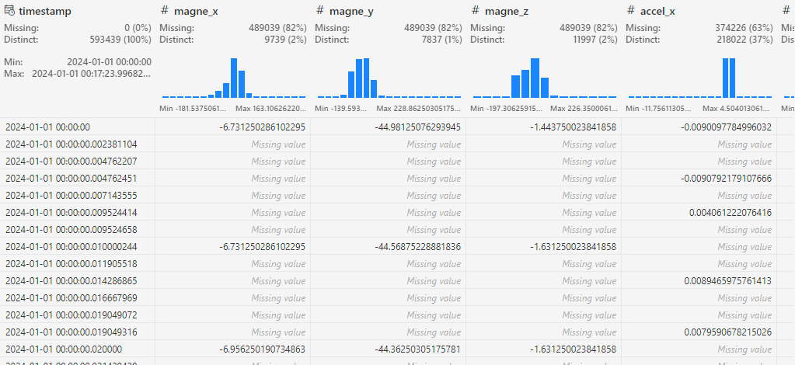

#### After Interpolation
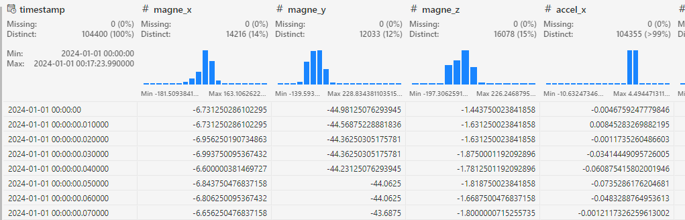

This is done to make sure, that a value taken from the magnetometer at time `t` is comparable to a value taken from a different feature at the same instant.


#### Sample Streams
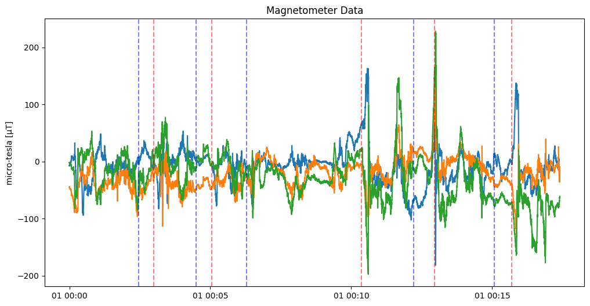
During motion the three coloured traces (x, y, z) hover
around zero with jitter of ±40 µT. At certain dashed blue lines
(stop-starts) you see sudden excursions—especially the huge +220 µT
spike just after 01 : 10. This is probably the moment the doors slide
open (or close in this case).
From this the feature mag_mag_std can be derived. It is the
standard deviation of the magnetometer signal over a sliding window of 1 second. (I put it here, because it was the first feature that had clear sections that matched the intervals)
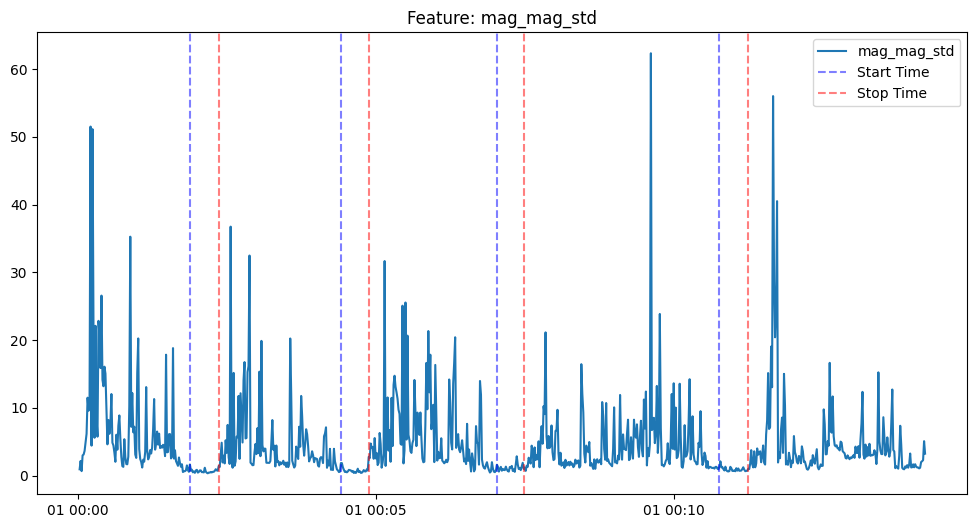

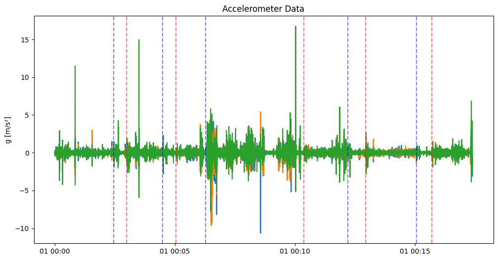
Specific force acting on the handset, i.e. linear acceleration + the 1 g gravity vector.
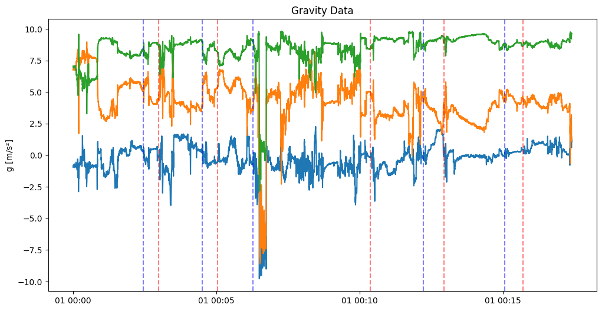
A virtual sensor that outputs only the gravity vector (orientation-aware low-pass of the accelerometer).
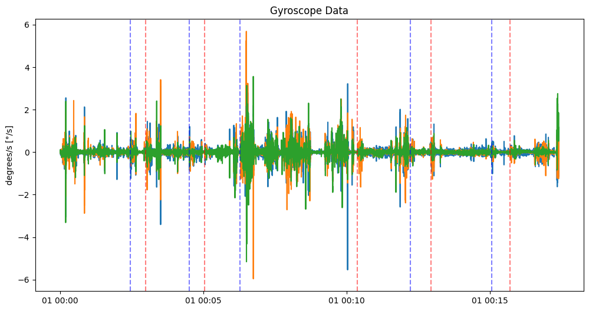
Angular velocity of the handset around x/y/z axes.

### 2.2 Feature Engineering
Instead of the twelve raw `x/y/z` channels, I condensed them to three magnitudes that are more stable across phone orientations (Or at least that was the idea).
- $\text{dyn\_acc} = ||\text{accelerometer} – \text{gravity}||$ 
- $\text{gyro\_mag} = ||\text{gyroscope}||$ 
- $\text{mag\_mag} = ||\text{magnetometer}||$


```python
acc = df_uniform[["accel_x", "accel_y", "accel_z"]].values
gra = df_uniform[["gravi_x", "gravi_y", "gravi_z"]].values
gyr = df_uniform[["gyros_x", "gyros_y", "gyros_z"]].values

df_uniform["dyn_acc"] = np.linalg.norm(acc - gra, axis=1)
df_uniform["gyro_mag"] = np.linalg.norm(gyr, axis=1)
df_uniform["mag_mag"] = np.linalg.norm(
    df_uniform[["magne_x", "magne_y", "magne_z"]].values, axis=1
)
```

The new features look like this:
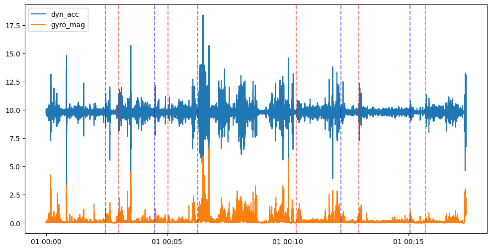
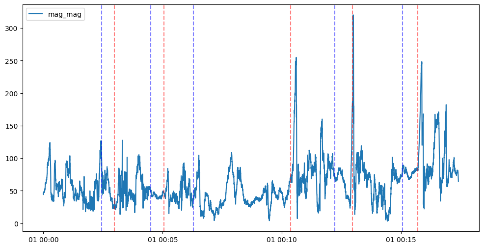
(The vertical lines indicate the start and end of a stop)

After that I aggregated the data to 1 second intervals and calculated the mean, max, std and median of the features:
| Channel   | mean | std | max | median |
| --------- | ---- | --- | --- | ------ |
| dyn\_acc  | ✓    | ✓   | ✓   | ✓      |
| gyro\_mag | ✓    | ✓   | ✓   | –      |
| mag\_mag  | –    | ✓   | –   | –      |

The mean of dyn_acc and gyro_mag tells the overall vibration
level
The max value picks up the jolts that happen right
when the train begins to move or when the brakes grab just before it stops.
The standard deviation tells us how "busy" the signal is. While the train is parked at a station the readings hardly change, so the standard deviation is very small. Out on the track they fluctuate more, so the value is larger.
The Median of dyn_acc gives a typical vibration level that is not distorted by an occasional big spike.


These Features already worked quite well and scored 0.375 on the leaderboard.
However, these descriptors per second are too static, as they don't tell anything about the past, so I added temporal context (Lag features)

For each of the eight base columns I append its value one to twenty
seconds in the past (`*_lagk`) and also computed the difference between the currrent window and every window d=1...20 s before it. (See Hyperparameter tuning for more details)


I experimented with additional ideas (FFT energy in the 0–3 Hz band,
rolling variance of the magnetic field, station ID guessing) but the I couldn't find an improvement during the hyperparameter/feature tuning.


### 2.3 Classifier
For classification I used a QuantileClipper so every column is clamped to its 1 %
and 99 % training quantiles. This removes occasional sensor spikes (outliers).

The Classifier itself is a `HistGradientBoostingClassifier` from `sklearn`. 
It is a tree-based model that is very fast to train and has a good performance. I decided to use it, because I learned from a previous challenge, that those models often perform well on similar challenges on Kaggle.

Using this type of model helped me to iterate quickly as I don't have to wait for the model to train compared to NNs which usually need a long time to converge and don't necessarily yield much better results.

I tuned the classifier and features using a grid search [see hyperparameter tuning MODEL for more details](hyperparameter_tuning_model.py). 


The final models use a total of `328` features. See more in [EXPERIMENT RESULTS EXP 18](results/exp_18.md)


### 2.4 Postprocessing - Turning predictions into intervals
After predicting the probabilities, the output of a sample looks the following:
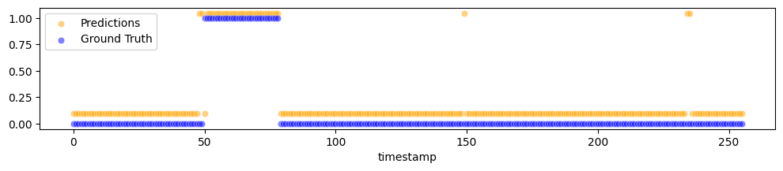
As we can see, the model does not perfectly capture the intervals so we cannot simply merge the predictions into intervals. Therefore, I postprocessed the predictions using a set of heuristics which I thought would work well for this problem. The four tuned heuristics are:

1. Threshold the probability at 0.50.
2. Median-filter the binary mask with a 5-frame kernel to erase lone flips.
3. Discard any positive run shorter than three seconds (doors cannot open faster).
4. Merge consecutive runs if the gap is ≤ two seconds to cover brief confidence dips.

Initially, I set the values by experimenting manually with the data, but later I used a grid search over 43200 combinations of the parameters to find the best values. ([See Hyperparameter tuning POSTPROC for more details](hyperparameter_tuning_postprocessing.py))


## 3. Results
On a 20 % group hold-out the final configuration reaches the following scores:
```
F1 Score: 0.839
Precision: 0.770
Recall: 0.922
Accuracy: 0.934
```
and, after interval post-processing, a Jaccard of `0.722` on the hidden challenge test set. 
(The final model trains on the whole training set, so the hold-out scores are not directly comparable to the leaderboard scores, but give a good indication of the model's performance)


The Confusion Matrix looks the following:
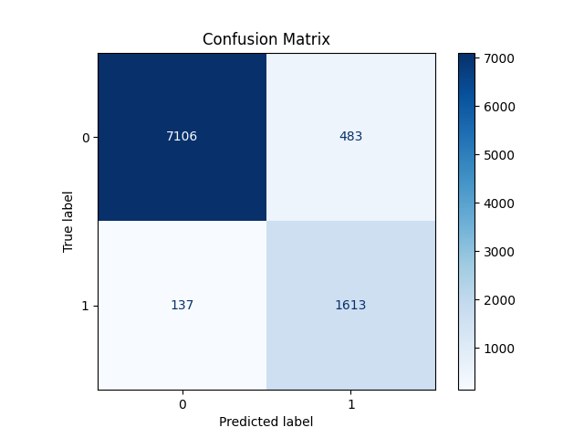


## 4. Iterate Quickly 
All training ran (including grid searches and the post-processing)  on my machine. Each run is logged by `log_experiments.py`, which writes a markdown file containing `F1`, `precision`, `recall`, `accuracy`, and a  `confusion matrix`. This "living diary" lets me compare experiments ten days later without opening a single notebook.

`train_final_model.py` saves every promising fit via `save_model()` as
`train_stop_detector_final_*.joblib` plus a matching `JSON`. The
challenge server only runs `solution.py`. The script loads the
newest artefact, recreates exactly the same 328-feature table, applies
the gradient-boosting model and converts the probabilities to stop
intervals with the tuned heuristics. Because no learning happens on the
server, I was able to iterate fast on the submissions and I can freely decide which locally validated model goes into production.

Everytime I found a promising model, I used the command:
```bash 
rsync -avz --exclude-from=.gitignore . thomas@raid:/home/user/
```
to upload everything to the server and the `solution.py` is written to automatically load the latest model so only minimal changes are needed to submit a new version.


# Appendix (Notes for myself)


## Current files
- train_final_model.py uses optimized parameters from `hyperparameter_tuning_model.py` and `hyperparameter_tuning_postprocessing.py`

## Commands
```bash
task submit
task reset
task check
task id
task info
```

---

##  Upload Download
```bash
# Download
scp -P 2222 <task_name>@raid:/home/user/<filename> <filename>

# Upload
scp -P 2222 <filename> <task_name>@raid:/home/user/<filename>
```

##  Auto Sync
```bash
# Upload everything from the current directory that is not ignored
rsync -avz --exclude-from=.gitignore . <task_name>@raid:/home/user/

```


---

## Task
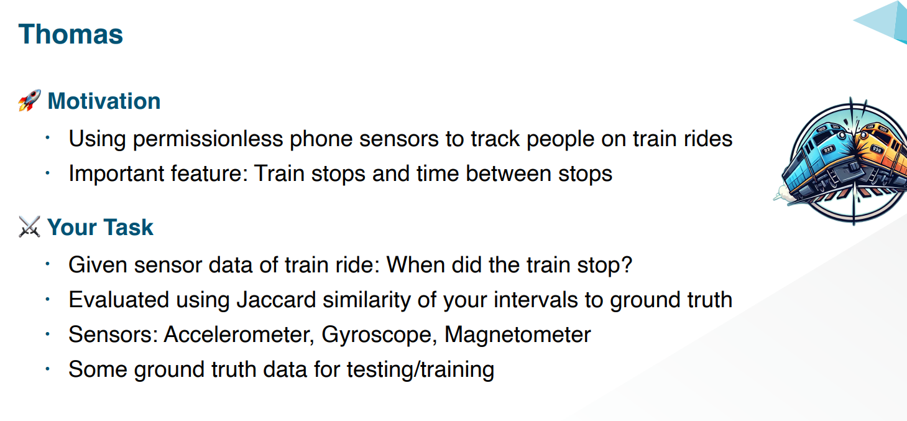


---
When putting all the data feature streams together, we have a total of 12 features. However, the features have different sampling rates. This can also be seen, when putting the data into a pandas dataframe:
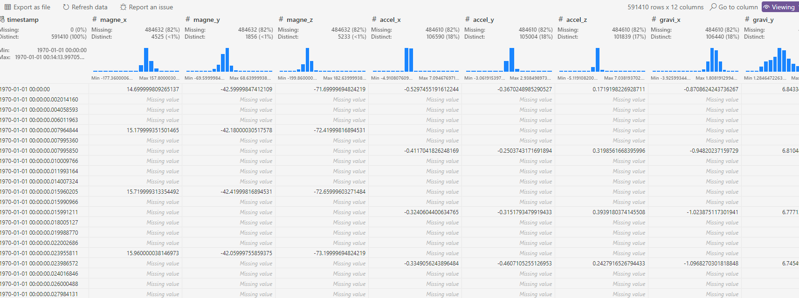


## Open Questions
- What is the Sampling rate of the data? 
    - Answer: Variable from recording and feature to feature.


---
## Submissions
- The first submission currently outperforms all the other submissions.
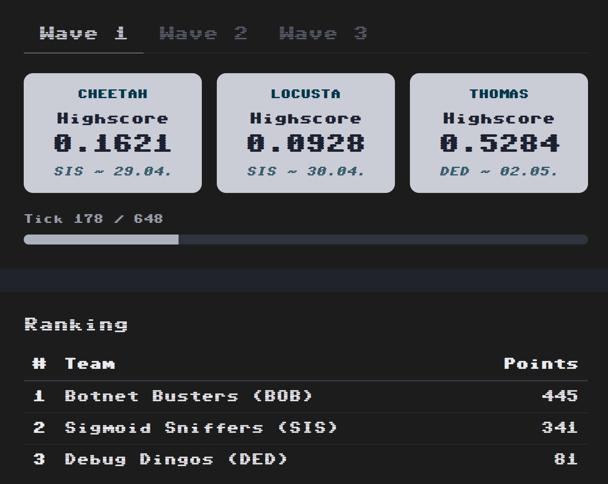

(Fri May  2 22:54:54 UTC 2025)
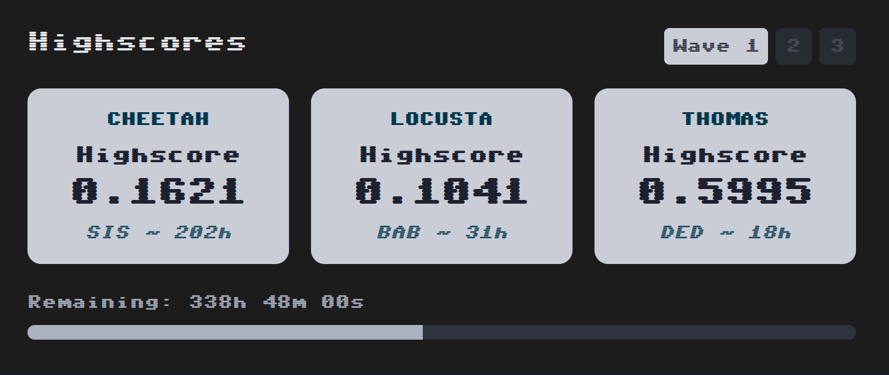

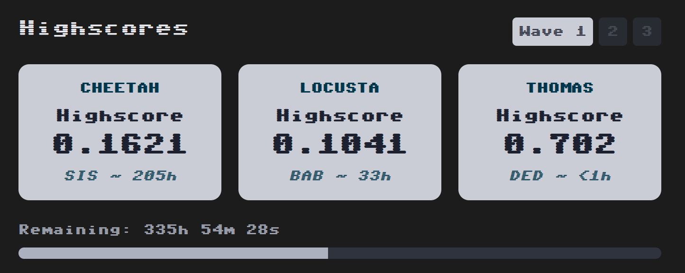

## Highscore!
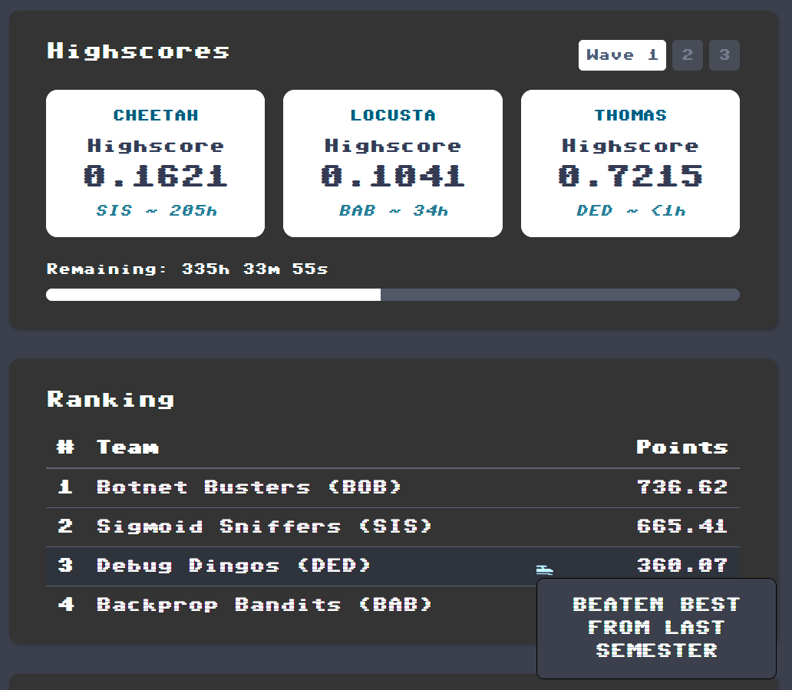


## tuning

```
  feat={'lag_steps': [1, 2, 3, 4, 5, 6, 7, 8, 9, 10, 11, 12, 13, 14, 15, 16, 17, 18, 19, 20], 'add_diff': True, 'add_extra': False}
  hgb={'max_depth': 10, 'learning_rate': 0.15}
Validation F1 (classifier only) = 0.820
```
### Postproc tuning
interval_f1_at_tau
`Best IoU=0.123  cfg={'thr': 0.7, 'min_stop': 5, 'merge_gap': 2, 'med_k': 5, 'win_len': 1.0}`
<<< Best IoU=0.167  cfg={'thr': 0.5, 'min_stop': 3, 'merge_gap': 2, 'med_k': 5, 'win_len': 1.0}


set_jaccard
`Best IoU=0.049  cfg={'thr': 0.6, 'min_stop': 5, 'merge_gap': 2, 'med_k': 5, 'win_len': 1.0}`

<<< Best IoU=0.057  cfg={'thr': 0.75, 'min_stop': 1, 'merge_gap': 2, 'med_k': 5, 'win_len': 1.0}

---


### Full model tuning (Try No. 1 without diffs)

```
{'lag_steps': [1, 2, 3, 4, 5, 6, 7, 8, 9, 10, 11, 12, 13, 14, 15, 16, 17, 18, 19, 20], 'add_diff': True, 'add_extra': True} {'max_depth': 10, 'learning_rate': 0.07}  →  F1=0.772
{'lag_steps': [1, 2, 3, 4, 5, 6, 7, 8, 9, 10, 11, 12, 13, 14, 15, 16, 17, 18, 19, 20], 'add_diff': True, 'add_extra': True} {'max_depth': 10, 'learning_rate': 0.1}  →  F1=0.779
{'lag_steps': [1, 2, 3, 4, 5, 6, 7, 8, 9, 10, 11, 12, 13, 14, 15, 16, 17, 18, 19, 20], 'add_diff': True, 'add_extra': True} {'max_depth': 10, 'learning_rate': 0.12}  →  F1=0.785
{'lag_steps': [1, 2, 3, 4, 5, 6, 7, 8, 9, 10, 11, 12, 13, 14, 15, 16, 17, 18, 19, 20], 'add_diff': True, 'add_extra': True} {'max_depth': 10, 'learning_rate': 0.15}  →  F1=0.782
{'lag_steps': [1, 2, 3, 4, 5, 6, 7, 8, 9, 10, 11, 12, 13, 14, 15, 16, 17, 18, 19, 20], 'add_diff': True, 'add_extra': True} {'max_depth': 10, 'learning_rate': 0.2}  →  F1=0.786
{'lag_steps': [1, 2, 3, 4, 5, 6, 7, 8, 9, 10, 11, 12, 13, 14, 15, 16, 17, 18, 19, 20], 'add_diff': True, 'add_extra': True} {'max_depth': 10, 'learning_rate': 0.25}  →  F1=0.784
{'lag_steps': [1, 2, 3, 4, 5, 6, 7, 8, 9, 10, 11, 12, 13, 14, 15, 16, 17, 18, 19, 20], 'add_diff': True, 'add_extra': True} {'max_depth': 20, 'learning_rate': 0.07}  →  F1=0.772
{'lag_steps': [1, 2, 3, 4, 5, 6, 7, 8, 9, 10, 11, 12, 13, 14, 15, 16, 17, 18, 19, 20], 'add_diff': True, 'add_extra': True} {'max_depth': 20, 'learning_rate': 0.1}  →  F1=0.781
{'lag_steps': [1, 2, 3, 4, 5, 6, 7, 8, 9, 10, 11, 12, 13, 14, 15, 16, 17, 18, 19, 20], 'add_diff': True, 'add_extra': True} {'max_depth': 20, 'learning_rate': 0.12}  →  F1=0.787
{'lag_steps': [1, 2, 3, 4, 5, 6, 7, 8, 9, 10, 11, 12, 13, 14, 15, 16, 17, 18, 19, 20], 'add_diff': True, 'add_extra': True} {'max_depth': 20, 'learning_rate': 0.15}  →  F1=0.790
{'lag_steps': [1, 2, 3, 4, 5, 6, 7, 8, 9, 10, 11, 12, 13, 14, 15, 16, 17, 18, 19, 20], 'add_diff': True, 'add_extra': True} {'max_depth': 20, 'learning_rate': 0.2}  →  F1=0.786
{'lag_steps': [1, 2, 3, 4, 5, 6, 7, 8, 9, 10, 11, 12, 13, 14, 15, 16, 17, 18, 19, 20], 'add_diff': True, 'add_extra': True} {'max_depth': 20, 'learning_rate': 0.25}  →  F1=0.778
{'lag_steps': [1, 2, 3, 4, 5, 6, 7, 8, 9, 10, 11, 12, 13, 14, 15, 16, 17, 18, 19, 20], 'add_diff': True, 'add_extra': True} {'max_depth': 30, 'learning_rate': 0.07}  →  F1=0.772
{'lag_steps': [1, 2, 3, 4, 5, 6, 7, 8, 9, 10, 11, 12, 13, 14, 15, 16, 17, 18, 19, 20], 'add_diff': True, 'add_extra': True} {'max_depth': 30, 'learning_rate': 0.1}  →  F1=0.781
{'lag_steps': [1, 2, 3, 4, 5, 6, 7, 8, 9, 10, 11, 12, 13, 14, 15, 16, 17, 18, 19, 20], 'add_diff': True, 'add_extra': True} {'max_depth': 30, 'learning_rate': 0.12}  →  F1=0.787
{'lag_steps': [1, 2, 3, 4, 5, 6, 7, 8, 9, 10, 11, 12, 13, 14, 15, 16, 17, 18, 19, 20], 'add_diff': True, 'add_extra': True} {'max_depth': 30, 'learning_rate': 0.15}  →  F1=0.790
{'lag_steps': [1, 2, 3, 4, 5, 6, 7, 8, 9, 10, 11, 12, 13, 14, 15, 16, 17, 18, 19, 20], 'add_diff': True, 'add_extra': True} {'max_depth': 30, 'learning_rate': 0.2}  →  F1=0.786
{'lag_steps': [1, 2, 3, 4, 5, 6, 7, 8, 9, 10, 11, 12, 13, 14, 15, 16, 17, 18, 19, 20], 'add_diff': True, 'add_extra': True} {'max_depth': 30, 'learning_rate': 0.25}  →  F1=0.778
{'lag_steps': [1, 2, 3, 4, 5, 6, 7, 8, 9, 10, 11, 12, 13, 14, 15, 16, 17, 18, 19, 20], 'add_diff': True, 'add_extra': True} {'max_depth': 50, 'learning_rate': 0.07}  →  F1=0.772
{'lag_steps': [1, 2, 3, 4, 5, 6, 7, 8, 9, 10, 11, 12, 13, 14, 15, 16, 17, 18, 19, 20], 'add_diff': True, 'add_extra': True} {'max_depth': 50, 'learning_rate': 0.1}  →  F1=0.781
{'lag_steps': [1, 2, 3, 4, 5, 6, 7, 8, 9, 10, 11, 12, 13, 14, 15, 16, 17, 18, 19, 20], 'add_diff': True, 'add_extra': True} {'max_depth': 50, 'learning_rate': 0.12}  →  F1=0.787
{'lag_steps': [1, 2, 3, 4, 5, 6, 7, 8, 9, 10, 11, 12, 13, 14, 15, 16, 17, 18, 19, 20], 'add_diff': True, 'add_extra': True} {'max_depth': 50, 'learning_rate': 0.15}  →  F1=0.790
{'lag_steps': [1, 2, 3, 4, 5, 6, 7, 8, 9, 10, 11, 12, 13, 14, 15, 16, 17, 18, 19, 20], 'add_diff': True, 'add_extra': True} {'max_depth': 50, 'learning_rate': 0.2}  →  F1=0.786
{'lag_steps': [1, 2, 3, 4, 5, 6, 7, 8, 9, 10, 11, 12, 13, 14, 15, 16, 17, 18, 19, 20], 'add_diff': True, 'add_extra': True} {'max_depth': 50, 'learning_rate': 0.25}  →  F1=0.778
{'lag_steps': [1, 2, 3, 4, 5, 6, 7, 8, 9, 10, 11, 12, 13, 14, 15, 16, 17, 18, 19, 20], 'add_diff': True, 'add_extra': True} {'max_depth': 100, 'learning_rate': 0.07}  →  F1=0.772
{'lag_steps': [1, 2, 3, 4, 5, 6, 7, 8, 9, 10, 11, 12, 13, 14, 15, 16, 17, 18, 19, 20], 'add_diff': True, 'add_extra': True} {'max_depth': 100, 'learning_rate': 0.1}  →  F1=0.781
{'lag_steps': [1, 2, 3, 4, 5, 6, 7, 8, 9, 10, 11, 12, 13, 14, 15, 16, 17, 18, 19, 20], 'add_diff': True, 'add_extra': True} {'max_depth': 100, 'learning_rate': 0.12}  →  F1=0.787
{'lag_steps': [1, 2, 3, 4, 5, 6, 7, 8, 9, 10, 11, 12, 13, 14, 15, 16, 17, 18, 19, 20], 'add_diff': True, 'add_extra': True} {'max_depth': 100, 'learning_rate': 0.15}  →  F1=0.790
{'lag_steps': [1, 2, 3, 4, 5, 6, 7, 8, 9, 10, 11, 12, 13, 14, 15, 16, 17, 18, 19, 20], 'add_diff': True, 'add_extra': True} {'max_depth': 100, 'learning_rate': 0.2}  →  F1=0.786
{'lag_steps': [1, 2, 3, 4, 5, 6, 7, 8, 9, 10, 11, 12, 13, 14, 15, 16, 17, 18, 19, 20], 'add_diff': True, 'add_extra': True} {'max_depth': 100, 'learning_rate': 0.25}  →  F1=0.778
{'lag_steps': [1, 2, 3, 4, 5, 6, 7, 8, 9, 10, 11, 12, 13, 14, 15, 16, 17, 18, 19, 20], 'add_diff': False, 'add_extra': True} {'max_depth': 10, 'learning_rate': 0.07}  →  F1=0.774
{'lag_steps': [1, 2, 3, 4, 5, 6, 7, 8, 9, 10, 11, 12, 13, 14, 15, 16, 17, 18, 19, 20], 'add_diff': False, 'add_extra': True} {'max_depth': 10, 'learning_rate': 0.1}  →  F1=0.780
{'lag_steps': [1, 2, 3, 4, 5, 6, 7, 8, 9, 10, 11, 12, 13, 14, 15, 16, 17, 18, 19, 20], 'add_diff': False, 'add_extra': True} {'max_depth': 10, 'learning_rate': 0.12}  →  F1=0.785
{'lag_steps': [1, 2, 3, 4, 5, 6, 7, 8, 9, 10, 11, 12, 13, 14, 15, 16, 17, 18, 19, 20], 'add_diff': False, 'add_extra': True} {'max_depth': 10, 'learning_rate': 0.15}  →  F1=0.782
{'lag_steps': [1, 2, 3, 4, 5, 6, 7, 8, 9, 10, 11, 12, 13, 14, 15, 16, 17, 18, 19, 20], 'add_diff': False, 'add_extra': True} {'max_depth': 10, 'learning_rate': 0.2}  →  F1=0.785
{'lag_steps': [1, 2, 3, 4, 5, 6, 7, 8, 9, 10, 11, 12, 13, 14, 15, 16, 17, 18, 19, 20], 'add_diff': False, 'add_extra': True} {'max_depth': 10, 'learning_rate': 0.25}  →  F1=0.783
{'lag_steps': [1, 2, 3, 4, 5, 6, 7, 8, 9, 10, 11, 12, 13, 14, 15, 16, 17, 18, 19, 20], 'add_diff': False, 'add_extra': True} {'max_depth': 20, 'learning_rate': 0.07}  →  F1=0.771
{'lag_steps': [1, 2, 3, 4, 5, 6, 7, 8, 9, 10, 11, 12, 13, 14, 15, 16, 17, 18, 19, 20], 'add_diff': False, 'add_extra': True} {'max_depth': 20, 'learning_rate': 0.1}  →  F1=0.780
{'lag_steps': [1, 2, 3, 4, 5, 6, 7, 8, 9, 10, 11, 12, 13, 14, 15, 16, 17, 18, 19, 20], 'add_diff': False, 'add_extra': True} {'max_depth': 20, 'learning_rate': 0.12}  →  F1=0.782
{'lag_steps': [1, 2, 3, 4, 5, 6, 7, 8, 9, 10, 11, 12, 13, 14, 15, 16, 17, 18, 19, 20], 'add_diff': False, 'add_extra': True} {'max_depth': 20, 'learning_rate': 0.15}  →  F1=0.787
{'lag_steps': [1, 2, 3, 4, 5, 6, 7, 8, 9, 10, 11, 12, 13, 14, 15, 16, 17, 18, 19, 20], 'add_diff': False, 'add_extra': True} {'max_depth': 20, 'learning_rate': 0.2}  →  F1=0.785
{'lag_steps': [1, 2, 3, 4, 5, 6, 7, 8, 9, 10, 11, 12, 13, 14, 15, 16, 17, 18, 19, 20], 'add_diff': False, 'add_extra': True} {'max_depth': 20, 'learning_rate': 0.25}  →  F1=0.779
{'lag_steps': [1, 2, 3, 4, 5, 6, 7, 8, 9, 10, 11, 12, 13, 14, 15, 16, 17, 18, 19, 20], 'add_diff': False, 'add_extra': True} {'max_depth': 30, 'learning_rate': 0.07}  →  F1=0.771
{'lag_steps': [1, 2, 3, 4, 5, 6, 7, 8, 9, 10, 11, 12, 13, 14, 15, 16, 17, 18, 19, 20], 'add_diff': False, 'add_extra': True} {'max_depth': 30, 'learning_rate': 0.1}  →  F1=0.780
{'lag_steps': [1, 2, 3, 4, 5, 6, 7, 8, 9, 10, 11, 12, 13, 14, 15, 16, 17, 18, 19, 20], 'add_diff': False, 'add_extra': True} {'max_depth': 30, 'learning_rate': 0.12}  →  F1=0.782
{'lag_steps': [1, 2, 3, 4, 5, 6, 7, 8, 9, 10, 11, 12, 13, 14, 15, 16, 17, 18, 19, 20], 'add_diff': False, 'add_extra': True} {'max_depth': 30, 'learning_rate': 0.15}  →  F1=0.787
{'lag_steps': [1, 2, 3, 4, 5, 6, 7, 8, 9, 10, 11, 12, 13, 14, 15, 16, 17, 18, 19, 20], 'add_diff': False, 'add_extra': True} {'max_depth': 30, 'learning_rate': 0.2}  →  F1=0.785
{'lag_steps': [1, 2, 3, 4, 5, 6, 7, 8, 9, 10, 11, 12, 13, 14, 15, 16, 17, 18, 19, 20], 'add_diff': False, 'add_extra': True} {'max_depth': 30, 'learning_rate': 0.25}  →  F1=0.779
{'lag_steps': [1, 2, 3, 4, 5, 6, 7, 8, 9, 10, 11, 12, 13, 14, 15, 16, 17, 18, 19, 20], 'add_diff': False, 'add_extra': True} {'max_depth': 50, 'learning_rate': 0.07}  →  F1=0.771
{'lag_steps': [1, 2, 3, 4, 5, 6, 7, 8, 9, 10, 11, 12, 13, 14, 15, 16, 17, 18, 19, 20], 'add_diff': False, 'add_extra': True} {'max_depth': 50, 'learning_rate': 0.1}  →  F1=0.780
{'lag_steps': [1, 2, 3, 4, 5, 6, 7, 8, 9, 10, 11, 12, 13, 14, 15, 16, 17, 18, 19, 20], 'add_diff': False, 'add_extra': True} {'max_depth': 50, 'learning_rate': 0.12}  →  F1=0.782
{'lag_steps': [1, 2, 3, 4, 5, 6, 7, 8, 9, 10, 11, 12, 13, 14, 15, 16, 17, 18, 19, 20], 'add_diff': False, 'add_extra': True} {'max_depth': 50, 'learning_rate': 0.15}  →  F1=0.787
{'lag_steps': [1, 2, 3, 4, 5, 6, 7, 8, 9, 10, 11, 12, 13, 14, 15, 16, 17, 18, 19, 20], 'add_diff': False, 'add_extra': True} {'max_depth': 50, 'learning_rate': 0.2}  →  F1=0.785
{'lag_steps': [1, 2, 3, 4, 5, 6, 7, 8, 9, 10, 11, 12, 13, 14, 15, 16, 17, 18, 19, 20], 'add_diff': False, 'add_extra': True} {'max_depth': 50, 'learning_rate': 0.25}  →  F1=0.779
{'lag_steps': [1, 2, 3, 4, 5, 6, 7, 8, 9, 10, 11, 12, 13, 14, 15, 16, 17, 18, 19, 20], 'add_diff': False, 'add_extra': True} {'max_depth': 100, 'learning_rate': 0.07}  →  F1=0.771
{'lag_steps': [1, 2, 3, 4, 5, 6, 7, 8, 9, 10, 11, 12, 13, 14, 15, 16, 17, 18, 19, 20], 'add_diff': False, 'add_extra': True} {'max_depth': 100, 'learning_rate': 0.1}  →  F1=0.780
{'lag_steps': [1, 2, 3, 4, 5, 6, 7, 8, 9, 10, 11, 12, 13, 14, 15, 16, 17, 18, 19, 20], 'add_diff': False, 'add_extra': True} {'max_depth': 100, 'learning_rate': 0.12}  →  F1=0.782
{'lag_steps': [1, 2, 3, 4, 5, 6, 7, 8, 9, 10, 11, 12, 13, 14, 15, 16, 17, 18, 19, 20], 'add_diff': False, 'add_extra': True} {'max_depth': 100, 'learning_rate': 0.15}  →  F1=0.787
{'lag_steps': [1, 2, 3, 4, 5, 6, 7, 8, 9, 10, 11, 12, 13, 14, 15, 16, 17, 18, 19, 20], 'add_diff': False, 'add_extra': True} {'max_depth': 100, 'learning_rate': 0.2}  →  F1=0.785
{'lag_steps': [1, 2, 3, 4, 5, 6, 7, 8, 9, 10, 11, 12, 13, 14, 15, 16, 17, 18, 19, 20], 'add_diff': False, 'add_extra': True} {'max_depth': 100, 'learning_rate': 0.25}  →  F1=0.779
{'lag_steps': [1, 2, 3, 4, 5, 6, 7, 8, 9, 10, 11, 12, 13, 14, 15, 16, 17, 18, 19, 20], 'add_diff': True, 'add_extra': False} {'max_depth': 10, 'learning_rate': 0.07}  →  F1=0.772
{'lag_steps': [1, 2, 3, 4, 5, 6, 7, 8, 9, 10, 11, 12, 13, 14, 15, 16, 17, 18, 19, 20], 'add_diff': True, 'add_extra': False} {'max_depth': 10, 'learning_rate': 0.1}  →  F1=0.781
{'lag_steps': [1, 2, 3, 4, 5, 6, 7, 8, 9, 10, 11, 12, 13, 14, 15, 16, 17, 18, 19, 20], 'add_diff': True, 'add_extra': False} {'max_depth': 10, 'learning_rate': 0.12}  →  F1=0.784
{'lag_steps': [1, 2, 3, 4, 5, 6, 7, 8, 9, 10, 11, 12, 13, 14, 15, 16, 17, 18, 19, 20], 'add_diff': True, 'add_extra': False} {'max_depth': 10, 'learning_rate': 0.15}  →  F1=0.790
{'lag_steps': [1, 2, 3, 4, 5, 6, 7, 8, 9, 10, 11, 12, 13, 14, 15, 16, 17, 18, 19, 20], 'add_diff': True, 'add_extra': False} {'max_depth': 10, 'learning_rate': 0.2}  →  F1=0.784
{'lag_steps': [1, 2, 3, 4, 5, 6, 7, 8, 9, 10, 11, 12, 13, 14, 15, 16, 17, 18, 19, 20], 'add_diff': True, 'add_extra': False} {'max_depth': 10, 'learning_rate': 0.25}  →  F1=0.783
{'lag_steps': [1, 2, 3, 4, 5, 6, 7, 8, 9, 10, 11, 12, 13, 14, 15, 16, 17, 18, 19, 20], 'add_diff': True, 'add_extra': False} {'max_depth': 20, 'learning_rate': 0.07}  →  F1=0.771
{'lag_steps': [1, 2, 3, 4, 5, 6, 7, 8, 9, 10, 11, 12, 13, 14, 15, 16, 17, 18, 19, 20], 'add_diff': True, 'add_extra': False} {'max_depth': 20, 'learning_rate': 0.1}  →  F1=0.781
{'lag_steps': [1, 2, 3, 4, 5, 6, 7, 8, 9, 10, 11, 12, 13, 14, 15, 16, 17, 18, 19, 20], 'add_diff': True, 'add_extra': False} {'max_depth': 20, 'learning_rate': 0.12}  →  F1=0.784
{'lag_steps': [1, 2, 3, 4, 5, 6, 7, 8, 9, 10, 11, 12, 13, 14, 15, 16, 17, 18, 19, 20], 'add_diff': True, 'add_extra': False} {'max_depth': 20, 'learning_rate': 0.15}  →  F1=0.789
{'lag_steps': [1, 2, 3, 4, 5, 6, 7, 8, 9, 10, 11, 12, 13, 14, 15, 16, 17, 18, 19, 20], 'add_diff': True, 'add_extra': False} {'max_depth': 20, 'learning_rate': 0.2}  →  F1=0.786
{'lag_steps': [1, 2, 3, 4, 5, 6, 7, 8, 9, 10, 11, 12, 13, 14, 15, 16, 17, 18, 19, 20], 'add_diff': True, 'add_extra': False} {'max_depth': 20, 'learning_rate': 0.25}  →  F1=0.784
{'lag_steps': [1, 2, 3, 4, 5, 6, 7, 8, 9, 10, 11, 12, 13, 14, 15, 16, 17, 18, 19, 20], 'add_diff': True, 'add_extra': False} {'max_depth': 30, 'learning_rate': 0.07}  →  F1=0.771
{'lag_steps': [1, 2, 3, 4, 5, 6, 7, 8, 9, 10, 11, 12, 13, 14, 15, 16, 17, 18, 19, 20], 'add_diff': True, 'add_extra': False} {'max_depth': 30, 'learning_rate': 0.1}  →  F1=0.781
{'lag_steps': [1, 2, 3, 4, 5, 6, 7, 8, 9, 10, 11, 12, 13, 14, 15, 16, 17, 18, 19, 20], 'add_diff': True, 'add_extra': False} {'max_depth': 30, 'learning_rate': 0.12}  →  F1=0.784
{'lag_steps': [1, 2, 3, 4, 5, 6, 7, 8, 9, 10, 11, 12, 13, 14, 15, 16, 17, 18, 19, 20], 'add_diff': True, 'add_extra': False} {'max_depth': 30, 'learning_rate': 0.15}  →  F1=0.789
{'lag_steps': [1, 2, 3, 4, 5, 6, 7, 8, 9, 10, 11, 12, 13, 14, 15, 16, 17, 18, 19, 20], 'add_diff': True, 'add_extra': False} {'max_depth': 30, 'learning_rate': 0.2}  →  F1=0.786
{'lag_steps': [1, 2, 3, 4, 5, 6, 7, 8, 9, 10, 11, 12, 13, 14, 15, 16, 17, 18, 19, 20], 'add_diff': True, 'add_extra': False} {'max_depth': 30, 'learning_rate': 0.25}  →  F1=0.784
{'lag_steps': [1, 2, 3, 4, 5, 6, 7, 8, 9, 10, 11, 12, 13, 14, 15, 16, 17, 18, 19, 20], 'add_diff': True, 'add_extra': False} {'max_depth': 50, 'learning_rate': 0.07}  →  F1=0.771
{'lag_steps': [1, 2, 3, 4, 5, 6, 7, 8, 9, 10, 11, 12, 13, 14, 15, 16, 17, 18, 19, 20], 'add_diff': True, 'add_extra': False} {'max_depth': 50, 'learning_rate': 0.1}  →  F1=0.781
{'lag_steps': [1, 2, 3, 4, 5, 6, 7, 8, 9, 10, 11, 12, 13, 14, 15, 16, 17, 18, 19, 20], 'add_diff': True, 'add_extra': False} {'max_depth': 50, 'learning_rate': 0.12}  →  F1=0.784
{'lag_steps': [1, 2, 3, 4, 5, 6, 7, 8, 9, 10, 11, 12, 13, 14, 15, 16, 17, 18, 19, 20], 'add_diff': True, 'add_extra': False} {'max_depth': 50, 'learning_rate': 0.15}  →  F1=0.789
{'lag_steps': [1, 2, 3, 4, 5, 6, 7, 8, 9, 10, 11, 12, 13, 14, 15, 16, 17, 18, 19, 20], 'add_diff': True, 'add_extra': False} {'max_depth': 50, 'learning_rate': 0.2}  →  F1=0.786
{'lag_steps': [1, 2, 3, 4, 5, 6, 7, 8, 9, 10, 11, 12, 13, 14, 15, 16, 17, 18, 19, 20], 'add_diff': True, 'add_extra': False} {'max_depth': 50, 'learning_rate': 0.25}  →  F1=0.784
{'lag_steps': [1, 2, 3, 4, 5, 6, 7, 8, 9, 10, 11, 12, 13, 14, 15, 16, 17, 18, 19, 20], 'add_diff': True, 'add_extra': False} {'max_depth': 100, 'learning_rate': 0.07}  →  F1=0.771
{'lag_steps': [1, 2, 3, 4, 5, 6, 7, 8, 9, 10, 11, 12, 13, 14, 15, 16, 17, 18, 19, 20], 'add_diff': True, 'add_extra': False} {'max_depth': 100, 'learning_rate': 0.1}  →  F1=0.781
{'lag_steps': [1, 2, 3, 4, 5, 6, 7, 8, 9, 10, 11, 12, 13, 14, 15, 16, 17, 18, 19, 20], 'add_diff': True, 'add_extra': False} {'max_depth': 100, 'learning_rate': 0.12}  →  F1=0.784
{'lag_steps': [1, 2, 3, 4, 5, 6, 7, 8, 9, 10, 11, 12, 13, 14, 15, 16, 17, 18, 19, 20], 'add_diff': True, 'add_extra': False} {'max_depth': 100, 'learning_rate': 0.15}  →  F1=0.789
{'lag_steps': [1, 2, 3, 4, 5, 6, 7, 8, 9, 10, 11, 12, 13, 14, 15, 16, 17, 18, 19, 20], 'add_diff': True, 'add_extra': False} {'max_depth': 100, 'learning_rate': 0.2}  →  F1=0.786
{'lag_steps': [1, 2, 3, 4, 5, 6, 7, 8, 9, 10, 11, 12, 13, 14, 15, 16, 17, 18, 19, 20], 'add_diff': True, 'add_extra': False} {'max_depth': 100, 'learning_rate': 0.25}  →  F1=0.784
{'lag_steps': [1, 2, 3, 4, 5, 6, 7, 8, 9, 10, 11, 12, 13, 14, 15, 16, 17, 18, 19, 20], 'add_diff': False, 'add_extra': False} {'max_depth': 10, 'learning_rate': 0.07}  →  F1=0.771
{'lag_steps': [1, 2, 3, 4, 5, 6, 7, 8, 9, 10, 11, 12, 13, 14, 15, 16, 17, 18, 19, 20], 'add_diff': False, 'add_extra': False} {'max_depth': 10, 'learning_rate': 0.1}  →  F1=0.781
{'lag_steps': [1, 2, 3, 4, 5, 6, 7, 8, 9, 10, 11, 12, 13, 14, 15, 16, 17, 18, 19, 20], 'add_diff': False, 'add_extra': False} {'max_depth': 10, 'learning_rate': 0.12}  →  F1=0.785
{'lag_steps': [1, 2, 3, 4, 5, 6, 7, 8, 9, 10, 11, 12, 13, 14, 15, 16, 17, 18, 19, 20], 'add_diff': False, 'add_extra': False} {'max_depth': 10, 'learning_rate': 0.15}  →  F1=0.784
{'lag_steps': [1, 2, 3, 4, 5, 6, 7, 8, 9, 10, 11, 12, 13, 14, 15, 16, 17, 18, 19, 20], 'add_diff': False, 'add_extra': False} {'max_depth': 10, 'learning_rate': 0.2}  →  F1=0.783
{'lag_steps': [1, 2, 3, 4, 5, 6, 7, 8, 9, 10, 11, 12, 13, 14, 15, 16, 17, 18, 19, 20], 'add_diff': False, 'add_extra': False} {'max_depth': 10, 'learning_rate': 0.25}  →  F1=0.779
{'lag_steps': [1, 2, 3, 4, 5, 6, 7, 8, 9, 10, 11, 12, 13, 14, 15, 16, 17, 18, 19, 20], 'add_diff': False, 'add_extra': False} {'max_depth': 20, 'learning_rate': 0.07}  →  F1=0.772
{'lag_steps': [1, 2, 3, 4, 5, 6, 7, 8, 9, 10, 11, 12, 13, 14, 15, 16, 17, 18, 19, 20], 'add_diff': False, 'add_extra': False} {'max_depth': 20, 'learning_rate': 0.1}  →  F1=0.784
{'lag_steps': [1, 2, 3, 4, 5, 6, 7, 8, 9, 10, 11, 12, 13, 14, 15, 16, 17, 18, 19, 20], 'add_diff': False, 'add_extra': False} {'max_depth': 20, 'learning_rate': 0.12}  →  F1=0.784
{'lag_steps': [1, 2, 3, 4, 5, 6, 7, 8, 9, 10, 11, 12, 13, 14, 15, 16, 17, 18, 19, 20], 'add_diff': False, 'add_extra': False} {'max_depth': 20, 'learning_rate': 0.15}  →  F1=0.784
{'lag_steps': [1, 2, 3, 4, 5, 6, 7, 8, 9, 10, 11, 12, 13, 14, 15, 16, 17, 18, 19, 20], 'add_diff': False, 'add_extra': False} {'max_depth': 20, 'learning_rate': 0.2}  →  F1=0.785
{'lag_steps': [1, 2, 3, 4, 5, 6, 7, 8, 9, 10, 11, 12, 13, 14, 15, 16, 17, 18, 19, 20], 'add_diff': False, 'add_extra': False} {'max_depth': 20, 'learning_rate': 0.25}  →  F1=0.784
{'lag_steps': [1, 2, 3, 4, 5, 6, 7, 8, 9, 10, 11, 12, 13, 14, 15, 16, 17, 18, 19, 20], 'add_diff': False, 'add_extra': False} {'max_depth': 30, 'learning_rate': 0.07}  →  F1=0.772
{'lag_steps': [1, 2, 3, 4, 5, 6, 7, 8, 9, 10, 11, 12, 13, 14, 15, 16, 17, 18, 19, 20], 'add_diff': False, 'add_extra': False} {'max_depth': 30, 'learning_rate': 0.1}  →  F1=0.784
{'lag_steps': [1, 2, 3, 4, 5, 6, 7, 8, 9, 10, 11, 12, 13, 14, 15, 16, 17, 18, 19, 20], 'add_diff': False, 'add_extra': False} {'max_depth': 30, 'learning_rate': 0.12}  →  F1=0.784
{'lag_steps': [1, 2, 3, 4, 5, 6, 7, 8, 9, 10, 11, 12, 13, 14, 15, 16, 17, 18, 19, 20], 'add_diff': False, 'add_extra': False} {'max_depth': 30, 'learning_rate': 0.15}  →  F1=0.784
{'lag_steps': [1, 2, 3, 4, 5, 6, 7, 8, 9, 10, 11, 12, 13, 14, 15, 16, 17, 18, 19, 20], 'add_diff': False, 'add_extra': False} {'max_depth': 30, 'learning_rate': 0.2}  →  F1=0.785
{'lag_steps': [1, 2, 3, 4, 5, 6, 7, 8, 9, 10, 11, 12, 13, 14, 15, 16, 17, 18, 19, 20], 'add_diff': False, 'add_extra': False} {'max_depth': 30, 'learning_rate': 0.25}  →  F1=0.784
{'lag_steps': [1, 2, 3, 4, 5, 6, 7, 8, 9, 10, 11, 12, 13, 14, 15, 16, 17, 18, 19, 20], 'add_diff': False, 'add_extra': False} {'max_depth': 50, 'learning_rate': 0.07}  →  F1=0.772
{'lag_steps': [1, 2, 3, 4, 5, 6, 7, 8, 9, 10, 11, 12, 13, 14, 15, 16, 17, 18, 19, 20], 'add_diff': False, 'add_extra': False} {'max_depth': 50, 'learning_rate': 0.1}  →  F1=0.784
{'lag_steps': [1, 2, 3, 4, 5, 6, 7, 8, 9, 10, 11, 12, 13, 14, 15, 16, 17, 18, 19, 20], 'add_diff': False, 'add_extra': False} {'max_depth': 50, 'learning_rate': 0.12}  →  F1=0.784
{'lag_steps': [1, 2, 3, 4, 5, 6, 7, 8, 9, 10, 11, 12, 13, 14, 15, 16, 17, 18, 19, 20], 'add_diff': False, 'add_extra': False} {'max_depth': 50, 'learning_rate': 0.15}  →  F1=0.784
{'lag_steps': [1, 2, 3, 4, 5, 6, 7, 8, 9, 10, 11, 12, 13, 14, 15, 16, 17, 18, 19, 20], 'add_diff': False, 'add_extra': False} {'max_depth': 50, 'learning_rate': 0.2}  →  F1=0.785
{'lag_steps': [1, 2, 3, 4, 5, 6, 7, 8, 9, 10, 11, 12, 13, 14, 15, 16, 17, 18, 19, 20], 'add_diff': False, 'add_extra': False} {'max_depth': 50, 'learning_rate': 0.25}  →  F1=0.784
{'lag_steps': [1, 2, 3, 4, 5, 6, 7, 8, 9, 10, 11, 12, 13, 14, 15, 16, 17, 18, 19, 20], 'add_diff': False, 'add_extra': False} {'max_depth': 100, 'learning_rate': 0.07}  →  F1=0.772
{'lag_steps': [1, 2, 3, 4, 5, 6, 7, 8, 9, 10, 11, 12, 13, 14, 15, 16, 17, 18, 19, 20], 'add_diff': False, 'add_extra': False} {'max_depth': 100, 'learning_rate': 0.1}  →  F1=0.784
{'lag_steps': [1, 2, 3, 4, 5, 6, 7, 8, 9, 10, 11, 12, 13, 14, 15, 16, 17, 18, 19, 20], 'add_diff': False, 'add_extra': False} {'max_depth': 100, 'learning_rate': 0.12}  →  F1=0.784
{'lag_steps': [1, 2, 3, 4, 5, 6, 7, 8, 9, 10, 11, 12, 13, 14, 15, 16, 17, 18, 19, 20], 'add_diff': False, 'add_extra': False} {'max_depth': 100, 'learning_rate': 0.15}  →  F1=0.784
{'lag_steps': [1, 2, 3, 4, 5, 6, 7, 8, 9, 10, 11, 12, 13, 14, 15, 16, 17, 18, 19, 20], 'add_diff': False, 'add_extra': False} {'max_depth': 100, 'learning_rate': 0.2}  →  F1=0.785
{'lag_steps': [1, 2, 3, 4, 5, 6, 7, 8, 9, 10, 11, 12, 13, 14, 15, 16, 17, 18, 19, 20], 'add_diff': False, 'add_extra': False} {'max_depth': 100, 'learning_rate': 0.25}  →  F1=0.784
{'lag_steps': [1, 2, 3, 4, 5, 6, 7, 8, 9, 10, 11, 12, 13, 14, 15], 'add_diff': True, 'add_extra': False} {'max_depth': 10, 'learning_rate': 0.07}  →  F1=0.702
{'lag_steps': [1, 2, 3, 4, 5, 6, 7, 8, 9, 10, 11, 12, 13, 14, 15], 'add_diff': True, 'add_extra': False} {'max_depth': 10, 'learning_rate': 0.1}  →  F1=0.710
{'lag_steps': [1, 2, 3, 4, 5, 6, 7, 8, 9, 10, 11, 12, 13, 14, 15], 'add_diff': True, 'add_extra': False} {'max_depth': 10, 'learning_rate': 0.12}  →  F1=0.711
{'lag_steps': [1, 2, 3, 4, 5, 6, 7, 8, 9, 10, 11, 12, 13, 14, 15], 'add_diff': True, 'add_extra': False} {'max_depth': 10, 'learning_rate': 0.15}  →  F1=0.718
{'lag_steps': [1, 2, 3, 4, 5, 6, 7, 8, 9, 10, 11, 12, 13, 14, 15], 'add_diff': True, 'add_extra': False} {'max_depth': 10, 'learning_rate': 0.2}  →  F1=0.712
{'lag_steps': [1, 2, 3, 4, 5, 6, 7, 8, 9, 10, 11, 12, 13, 14, 15], 'add_diff': True, 'add_extra': False} {'max_depth': 10, 'learning_rate': 0.25}  →  F1=0.711
{'lag_steps': [1, 2, 3, 4, 5, 6, 7, 8, 9, 10, 11, 12, 13, 14, 15], 'add_diff': True, 'add_extra': False} {'max_depth': 20, 'learning_rate': 0.07}  →  F1=0.705
{'lag_steps': [1, 2, 3, 4, 5, 6, 7, 8, 9, 10, 11, 12, 13, 14, 15], 'add_diff': True, 'add_extra': False} {'max_depth': 20, 'learning_rate': 0.1}  →  F1=0.712
{'lag_steps': [1, 2, 3, 4, 5, 6, 7, 8, 9, 10, 11, 12, 13, 14, 15], 'add_diff': True, 'add_extra': False} {'max_depth': 20, 'learning_rate': 0.12}  →  F1=0.715
{'lag_steps': [1, 2, 3, 4, 5, 6, 7, 8, 9, 10, 11, 12, 13, 14, 15], 'add_diff': True, 'add_extra': False} {'max_depth': 20, 'learning_rate': 0.15}  →  F1=0.716
{'lag_steps': [1, 2, 3, 4, 5, 6, 7, 8, 9, 10, 11, 12, 13, 14, 15], 'add_diff': True, 'add_extra': False} {'max_depth': 20, 'learning_rate': 0.2}  →  F1=0.710
{'lag_steps': [1, 2, 3, 4, 5, 6, 7, 8, 9, 10, 11, 12, 13, 14, 15], 'add_diff': True, 'add_extra': False} {'max_depth': 20, 'learning_rate': 0.25}  →  F1=0.707
{'lag_steps': [1, 2, 3, 4, 5, 6, 7, 8, 9, 10, 11, 12, 13, 14, 15], 'add_diff': True, 'add_extra': False} {'max_depth': 30, 'learning_rate': 0.07}  →  F1=0.705
{'lag_steps': [1, 2, 3, 4, 5, 6, 7, 8, 9, 10, 11, 12, 13, 14, 15], 'add_diff': True, 'add_extra': False} {'max_depth': 30, 'learning_rate': 0.1}  →  F1=0.712
{'lag_steps': [1, 2, 3, 4, 5, 6, 7, 8, 9, 10, 11, 12, 13, 14, 15], 'add_diff': True, 'add_extra': False} {'max_depth': 30, 'learning_rate': 0.12}  →  F1=0.715
{'lag_steps': [1, 2, 3, 4, 5, 6, 7, 8, 9, 10, 11, 12, 13, 14, 15], 'add_diff': True, 'add_extra': False} {'max_depth': 30, 'learning_rate': 0.15}  →  F1=0.716
{'lag_steps': [1, 2, 3, 4, 5, 6, 7, 8, 9, 10, 11, 12, 13, 14, 15], 'add_diff': True, 'add_extra': False} {'max_depth': 30, 'learning_rate': 0.2}  →  F1=0.710
{'lag_steps': [1, 2, 3, 4, 5, 6, 7, 8, 9, 10, 11, 12, 13, 14, 15], 'add_diff': True, 'add_extra': False} {'max_depth': 30, 'learning_rate': 0.25}  →  F1=0.707
{'lag_steps': [1, 2, 3, 4, 5, 6, 7, 8, 9, 10, 11, 12, 13, 14, 15], 'add_diff': True, 'add_extra': False} {'max_depth': 50, 'learning_rate': 0.07}  →  F1=0.705
{'lag_steps': [1, 2, 3, 4, 5, 6, 7, 8, 9, 10, 11, 12, 13, 14, 15], 'add_diff': True, 'add_extra': False} {'max_depth': 50, 'learning_rate': 0.1}  →  F1=0.712
{'lag_steps': [1, 2, 3, 4, 5, 6, 7, 8, 9, 10, 11, 12, 13, 14, 15], 'add_diff': True, 'add_extra': False} {'max_depth': 50, 'learning_rate': 0.12}  →  F1=0.715
{'lag_steps': [1, 2, 3, 4, 5, 6, 7, 8, 9, 10, 11, 12, 13, 14, 15], 'add_diff': True, 'add_extra': False} {'max_depth': 50, 'learning_rate': 0.15}  →  F1=0.716
{'lag_steps': [1, 2, 3, 4, 5, 6, 7, 8, 9, 10, 11, 12, 13, 14, 15], 'add_diff': True, 'add_extra': False} {'max_depth': 50, 'learning_rate': 0.2}  →  F1=0.710
{'lag_steps': [1, 2, 3, 4, 5, 6, 7, 8, 9, 10, 11, 12, 13, 14, 15], 'add_diff': True, 'add_extra': False} {'max_depth': 50, 'learning_rate': 0.25}  →  F1=0.707
{'lag_steps': [1, 2, 3, 4, 5, 6, 7, 8, 9, 10, 11, 12, 13, 14, 15], 'add_diff': True, 'add_extra': False} {'max_depth': 100, 'learning_rate': 0.07}  →  F1=0.705
{'lag_steps': [1, 2, 3, 4, 5, 6, 7, 8, 9, 10, 11, 12, 13, 14, 15], 'add_diff': True, 'add_extra': False} {'max_depth': 100, 'learning_rate': 0.1}  →  F1=0.712
{'lag_steps': [1, 2, 3, 4, 5, 6, 7, 8, 9, 10, 11, 12, 13, 14, 15], 'add_diff': True, 'add_extra': False} {'max_depth': 100, 'learning_rate': 0.12}  →  F1=0.715
{'lag_steps': [1, 2, 3, 4, 5, 6, 7, 8, 9, 10, 11, 12, 13, 14, 15], 'add_diff': True, 'add_extra': False} {'max_depth': 100, 'learning_rate': 0.15}  →  F1=0.716
{'lag_steps': [1, 2, 3, 4, 5, 6, 7, 8, 9, 10, 11, 12, 13, 14, 15], 'add_diff': True, 'add_extra': False} {'max_depth': 100, 'learning_rate': 0.2}  →  F1=0.710
{'lag_steps': [1, 2, 3, 4, 5, 6, 7, 8, 9, 10, 11, 12, 13, 14, 15], 'add_diff': True, 'add_extra': False} {'max_depth': 100, 'learning_rate': 0.25}  →  F1=0.707
{'lag_steps': [1, 2, 3, 4, 5, 6, 7, 8, 9, 10, 11, 12, 13, 14, 15], 'add_diff': True, 'add_extra': True} {'max_depth': 10, 'learning_rate': 0.07}  →  F1=0.702
{'lag_steps': [1, 2, 3, 4, 5, 6, 7, 8, 9, 10, 11, 12, 13, 14, 15], 'add_diff': True, 'add_extra': True} {'max_depth': 10, 'learning_rate': 0.1}  →  F1=0.712
{'lag_steps': [1, 2, 3, 4, 5, 6, 7, 8, 9, 10, 11, 12, 13, 14, 15], 'add_diff': True, 'add_extra': True} {'max_depth': 10, 'learning_rate': 0.12}  →  F1=0.712
{'lag_steps': [1, 2, 3, 4, 5, 6, 7, 8, 9, 10, 11, 12, 13, 14, 15], 'add_diff': True, 'add_extra': True} {'max_depth': 10, 'learning_rate': 0.15}  →  F1=0.716
{'lag_steps': [1, 2, 3, 4, 5, 6, 7, 8, 9, 10, 11, 12, 13, 14, 15], 'add_diff': True, 'add_extra': True} {'max_depth': 10, 'learning_rate': 0.2}  →  F1=0.718
{'lag_steps': [1, 2, 3, 4, 5, 6, 7, 8, 9, 10, 11, 12, 13, 14, 15], 'add_diff': True, 'add_extra': True} {'max_depth': 10, 'learning_rate': 0.25}  →  F1=0.711
{'lag_steps': [1, 2, 3, 4, 5, 6, 7, 8, 9, 10, 11, 12, 13, 14, 15], 'add_diff': True, 'add_extra': True} {'max_depth': 20, 'learning_rate': 0.07}  →  F1=0.705
{'lag_steps': [1, 2, 3, 4, 5, 6, 7, 8, 9, 10, 11, 12, 13, 14, 15], 'add_diff': True, 'add_extra': True} {'max_depth': 20, 'learning_rate': 0.1}  →  F1=0.710
{'lag_steps': [1, 2, 3, 4, 5, 6, 7, 8, 9, 10, 11, 12, 13, 14, 15], 'add_diff': True, 'add_extra': True} {'max_depth': 20, 'learning_rate': 0.12}  →  F1=0.712
{'lag_steps': [1, 2, 3, 4, 5, 6, 7, 8, 9, 10, 11, 12, 13, 14, 15], 'add_diff': True, 'add_extra': True} {'max_depth': 20, 'learning_rate': 0.15}  →  F1=0.713
{'lag_steps': [1, 2, 3, 4, 5, 6, 7, 8, 9, 10, 11, 12, 13, 14, 15], 'add_diff': True, 'add_extra': True} {'max_depth': 20, 'learning_rate': 0.2}  →  F1=0.714
{'lag_steps': [1, 2, 3, 4, 5, 6, 7, 8, 9, 10, 11, 12, 13, 14, 15], 'add_diff': True, 'add_extra': True} {'max_depth': 20, 'learning_rate': 0.25}  →  F1=0.710
{'lag_steps': [1, 2, 3, 4, 5, 6, 7, 8, 9, 10, 11, 12, 13, 14, 15], 'add_diff': True, 'add_extra': True} {'max_depth': 30, 'learning_rate': 0.07}  →  F1=0.705
{'lag_steps': [1, 2, 3, 4, 5, 6, 7, 8, 9, 10, 11, 12, 13, 14, 15], 'add_diff': True, 'add_extra': True} {'max_depth': 30, 'learning_rate': 0.1}  →  F1=0.710
{'lag_steps': [1, 2, 3, 4, 5, 6, 7, 8, 9, 10, 11, 12, 13, 14, 15], 'add_diff': True, 'add_extra': True} {'max_depth': 30, 'learning_rate': 0.12}  →  F1=0.713
{'lag_steps': [1, 2, 3, 4, 5, 6, 7, 8, 9, 10, 11, 12, 13, 14, 15], 'add_diff': True, 'add_extra': True} {'max_depth': 30, 'learning_rate': 0.15}  →  F1=0.713
{'lag_steps': [1, 2, 3, 4, 5, 6, 7, 8, 9, 10, 11, 12, 13, 14, 15], 'add_diff': True, 'add_extra': True} {'max_depth': 30, 'learning_rate': 0.2}  →  F1=0.714
{'lag_steps': [1, 2, 3, 4, 5, 6, 7, 8, 9, 10, 11, 12, 13, 14, 15], 'add_diff': True, 'add_extra': True} {'max_depth': 30, 'learning_rate': 0.25}  →  F1=0.710
{'lag_steps': [1, 2, 3, 4, 5, 6, 7, 8, 9, 10, 11, 12, 13, 14, 15], 'add_diff': True, 'add_extra': True} {'max_depth': 50, 'learning_rate': 0.07}  →  F1=0.705
{'lag_steps': [1, 2, 3, 4, 5, 6, 7, 8, 9, 10, 11, 12, 13, 14, 15], 'add_diff': True, 'add_extra': True} {'max_depth': 50, 'learning_rate': 0.1}  →  F1=0.710
{'lag_steps': [1, 2, 3, 4, 5, 6, 7, 8, 9, 10, 11, 12, 13, 14, 15], 'add_diff': True, 'add_extra': True} {'max_depth': 50, 'learning_rate': 0.12}  →  F1=0.713
{'lag_steps': [1, 2, 3, 4, 5, 6, 7, 8, 9, 10, 11, 12, 13, 14, 15], 'add_diff': True, 'add_extra': True} {'max_depth': 50, 'learning_rate': 0.15}  →  F1=0.713
{'lag_steps': [1, 2, 3, 4, 5, 6, 7, 8, 9, 10, 11, 12, 13, 14, 15], 'add_diff': True, 'add_extra': True} {'max_depth': 50, 'learning_rate': 0.2}  →  F1=0.714
{'lag_steps': [1, 2, 3, 4, 5, 6, 7, 8, 9, 10, 11, 12, 13, 14, 15], 'add_diff': True, 'add_extra': True} {'max_depth': 50, 'learning_rate': 0.25}  →  F1=0.710
{'lag_steps': [1, 2, 3, 4, 5, 6, 7, 8, 9, 10, 11, 12, 13, 14, 15], 'add_diff': True, 'add_extra': True} {'max_depth': 100, 'learning_rate': 0.07}  →  F1=0.705
{'lag_steps': [1, 2, 3, 4, 5, 6, 7, 8, 9, 10, 11, 12, 13, 14, 15], 'add_diff': True, 'add_extra': True} {'max_depth': 100, 'learning_rate': 0.1}  →  F1=0.710
{'lag_steps': [1, 2, 3, 4, 5, 6, 7, 8, 9, 10, 11, 12, 13, 14, 15], 'add_diff': True, 'add_extra': True} {'max_depth': 100, 'learning_rate': 0.12}  →  F1=0.713
{'lag_steps': [1, 2, 3, 4, 5, 6, 7, 8, 9, 10, 11, 12, 13, 14, 15], 'add_diff': True, 'add_extra': True} {'max_depth': 100, 'learning_rate': 0.15}  →  F1=0.713
{'lag_steps': [1, 2, 3, 4, 5, 6, 7, 8, 9, 10, 11, 12, 13, 14, 15], 'add_diff': True, 'add_extra': True} {'max_depth': 100, 'learning_rate': 0.2}  →  F1=0.714
{'lag_steps': [1, 2, 3, 4, 5, 6, 7, 8, 9, 10, 11, 12, 13, 14, 15], 'add_diff': True, 'add_extra': True} {'max_depth': 100, 'learning_rate': 0.25}  →  F1=0.710
{'lag_steps': [1, 2, 3, 4, 5, 6, 7, 8, 9, 10, 11, 12, 13, 14, 15], 'add_diff': False, 'add_extra': False} {'max_depth': 10, 'learning_rate': 0.07}  →  F1=0.701
{'lag_steps': [1, 2, 3, 4, 5, 6, 7, 8, 9, 10, 11, 12, 13, 14, 15], 'add_diff': False, 'add_extra': False} {'max_depth': 10, 'learning_rate': 0.1}  →  F1=0.710
{'lag_steps': [1, 2, 3, 4, 5, 6, 7, 8, 9, 10, 11, 12, 13, 14, 15], 'add_diff': False, 'add_extra': False} {'max_depth': 10, 'learning_rate': 0.12}  →  F1=0.713
{'lag_steps': [1, 2, 3, 4, 5, 6, 7, 8, 9, 10, 11, 12, 13, 14, 15], 'add_diff': False, 'add_extra': False} {'max_depth': 10, 'learning_rate': 0.15}  →  F1=0.720
{'lag_steps': [1, 2, 3, 4, 5, 6, 7, 8, 9, 10, 11, 12, 13, 14, 15], 'add_diff': False, 'add_extra': False} {'max_depth': 10, 'learning_rate': 0.2}  →  F1=0.721
{'lag_steps': [1, 2, 3, 4, 5, 6, 7, 8, 9, 10, 11, 12, 13, 14, 15], 'add_diff': False, 'add_extra': False} {'max_depth': 10, 'learning_rate': 0.25}  →  F1=0.709
{'lag_steps': [1, 2, 3, 4, 5, 6, 7, 8, 9, 10, 11, 12, 13, 14, 15], 'add_diff': False, 'add_extra': False} {'max_depth': 20, 'learning_rate': 0.07}  →  F1=0.706
{'lag_steps': [1, 2, 3, 4, 5, 6, 7, 8, 9, 10, 11, 12, 13, 14, 15], 'add_diff': False, 'add_extra': False} {'max_depth': 20, 'learning_rate': 0.1}  →  F1=0.710
{'lag_steps': [1, 2, 3, 4, 5, 6, 7, 8, 9, 10, 11, 12, 13, 14, 15], 'add_diff': False, 'add_extra': False} {'max_depth': 20, 'learning_rate': 0.12}  →  F1=0.715
{'lag_steps': [1, 2, 3, 4, 5, 6, 7, 8, 9, 10, 11, 12, 13, 14, 15], 'add_diff': False, 'add_extra': False} {'max_depth': 20, 'learning_rate': 0.15}  →  F1=0.714
{'lag_steps': [1, 2, 3, 4, 5, 6, 7, 8, 9, 10, 11, 12, 13, 14, 15], 'add_diff': False, 'add_extra': False} {'max_depth': 20, 'learning_rate': 0.2}  →  F1=0.716
{'lag_steps': [1, 2, 3, 4, 5, 6, 7, 8, 9, 10, 11, 12, 13, 14, 15], 'add_diff': False, 'add_extra': False} {'max_depth': 20, 'learning_rate': 0.25}  →  F1=0.707
{'lag_steps': [1, 2, 3, 4, 5, 6, 7, 8, 9, 10, 11, 12, 13, 14, 15], 'add_diff': False, 'add_extra': False} {'max_depth': 30, 'learning_rate': 0.07}  →  F1=0.706
{'lag_steps': [1, 2, 3, 4, 5, 6, 7, 8, 9, 10, 11, 12, 13, 14, 15], 'add_diff': False, 'add_extra': False} {'max_depth': 30, 'learning_rate': 0.1}  →  F1=0.710
{'lag_steps': [1, 2, 3, 4, 5, 6, 7, 8, 9, 10, 11, 12, 13, 14, 15], 'add_diff': False, 'add_extra': False} {'max_depth': 30, 'learning_rate': 0.12}  →  F1=0.715
{'lag_steps': [1, 2, 3, 4, 5, 6, 7, 8, 9, 10, 11, 12, 13, 14, 15], 'add_diff': False, 'add_extra': False} {'max_depth': 30, 'learning_rate': 0.15}  →  F1=0.714
{'lag_steps': [1, 2, 3, 4, 5, 6, 7, 8, 9, 10, 11, 12, 13, 14, 15], 'add_diff': False, 'add_extra': False} {'max_depth': 30, 'learning_rate': 0.2}  →  F1=0.716
{'lag_steps': [1, 2, 3, 4, 5, 6, 7, 8, 9, 10, 11, 12, 13, 14, 15], 'add_diff': False, 'add_extra': False} {'max_depth': 30, 'learning_rate': 0.25}  →  F1=0.707
{'lag_steps': [1, 2, 3, 4, 5, 6, 7, 8, 9, 10, 11, 12, 13, 14, 15], 'add_diff': False, 'add_extra': False} {'max_depth': 50, 'learning_rate': 0.07}  →  F1=0.706
{'lag_steps': [1, 2, 3, 4, 5, 6, 7, 8, 9, 10, 11, 12, 13, 14, 15], 'add_diff': False, 'add_extra': False} {'max_depth': 50, 'learning_rate': 0.1}  →  F1=0.710
{'lag_steps': [1, 2, 3, 4, 5, 6, 7, 8, 9, 10, 11, 12, 13, 14, 15], 'add_diff': False, 'add_extra': False} {'max_depth': 50, 'learning_rate': 0.12}  →  F1=0.715
{'lag_steps': [1, 2, 3, 4, 5, 6, 7, 8, 9, 10, 11, 12, 13, 14, 15], 'add_diff': False, 'add_extra': False} {'max_depth': 50, 'learning_rate': 0.15}  →  F1=0.714
{'lag_steps': [1, 2, 3, 4, 5, 6, 7, 8, 9, 10, 11, 12, 13, 14, 15], 'add_diff': False, 'add_extra': False} {'max_depth': 50, 'learning_rate': 0.2}  →  F1=0.716
{'lag_steps': [1, 2, 3, 4, 5, 6, 7, 8, 9, 10, 11, 12, 13, 14, 15], 'add_diff': False, 'add_extra': False} {'max_depth': 50, 'learning_rate': 0.25}  →  F1=0.707
{'lag_steps': [1, 2, 3, 4, 5, 6, 7, 8, 9, 10, 11, 12, 13, 14, 15], 'add_diff': False, 'add_extra': False} {'max_depth': 100, 'learning_rate': 0.07}  →  F1=0.706
{'lag_steps': [1, 2, 3, 4, 5, 6, 7, 8, 9, 10, 11, 12, 13, 14, 15], 'add_diff': False, 'add_extra': False} {'max_depth': 100, 'learning_rate': 0.1}  →  F1=0.710
{'lag_steps': [1, 2, 3, 4, 5, 6, 7, 8, 9, 10, 11, 12, 13, 14, 15], 'add_diff': False, 'add_extra': False} {'max_depth': 100, 'learning_rate': 0.12}  →  F1=0.715
{'lag_steps': [1, 2, 3, 4, 5, 6, 7, 8, 9, 10, 11, 12, 13, 14, 15], 'add_diff': False, 'add_extra': False} {'max_depth': 100, 'learning_rate': 0.15}  →  F1=0.714
{'lag_steps': [1, 2, 3, 4, 5, 6, 7, 8, 9, 10, 11, 12, 13, 14, 15], 'add_diff': False, 'add_extra': False} {'max_depth': 100, 'learning_rate': 0.2}  →  F1=0.716
{'lag_steps': [1, 2, 3, 4, 5, 6, 7, 8, 9, 10, 11, 12, 13, 14, 15], 'add_diff': False, 'add_extra': False} {'max_depth': 100, 'learning_rate': 0.25}  →  F1=0.707
{'lag_steps': [1, 2, 3, 4, 5, 6, 7, 8, 9, 10, 11, 12, 13, 14, 15], 'add_diff': False, 'add_extra': True} {'max_depth': 10, 'learning_rate': 0.07}  →  F1=0.701
{'lag_steps': [1, 2, 3, 4, 5, 6, 7, 8, 9, 10, 11, 12, 13, 14, 15], 'add_diff': False, 'add_extra': True} {'max_depth': 10, 'learning_rate': 0.1}  →  F1=0.711
{'lag_steps': [1, 2, 3, 4, 5, 6, 7, 8, 9, 10, 11, 12, 13, 14, 15], 'add_diff': False, 'add_extra': True} {'max_depth': 10, 'learning_rate': 0.12}  →  F1=0.712
{'lag_steps': [1, 2, 3, 4, 5, 6, 7, 8, 9, 10, 11, 12, 13, 14, 15], 'add_diff': False, 'add_extra': True} {'max_depth': 10, 'learning_rate': 0.15}  →  F1=0.716
{'lag_steps': [1, 2, 3, 4, 5, 6, 7, 8, 9, 10, 11, 12, 13, 14, 15], 'add_diff': False, 'add_extra': True} {'max_depth': 10, 'learning_rate': 0.2}  →  F1=0.719
{'lag_steps': [1, 2, 3, 4, 5, 6, 7, 8, 9, 10, 11, 12, 13, 14, 15], 'add_diff': False, 'add_extra': True} {'max_depth': 10, 'learning_rate': 0.25}  →  F1=0.716
{'lag_steps': [1, 2, 3, 4, 5, 6, 7, 8, 9, 10, 11, 12, 13, 14, 15], 'add_diff': False, 'add_extra': True} {'max_depth': 20, 'learning_rate': 0.07}  →  F1=0.705
{'lag_steps': [1, 2, 3, 4, 5, 6, 7, 8, 9, 10, 11, 12, 13, 14, 15], 'add_diff': False, 'add_extra': True} {'max_depth': 20, 'learning_rate': 0.1}  →  F1=0.713
{'lag_steps': [1, 2, 3, 4, 5, 6, 7, 8, 9, 10, 11, 12, 13, 14, 15], 'add_diff': False, 'add_extra': True} {'max_depth': 20, 'learning_rate': 0.12}  →  F1=0.714
{'lag_steps': [1, 2, 3, 4, 5, 6, 7, 8, 9, 10, 11, 12, 13, 14, 15], 'add_diff': False, 'add_extra': True} {'max_depth': 20, 'learning_rate': 0.15}  →  F1=0.714
{'lag_steps': [1, 2, 3, 4, 5, 6, 7, 8, 9, 10, 11, 12, 13, 14, 15], 'add_diff': False, 'add_extra': True} {'max_depth': 20, 'learning_rate': 0.2}  →  F1=0.712
{'lag_steps': [1, 2, 3, 4, 5, 6, 7, 8, 9, 10, 11, 12, 13, 14, 15], 'add_diff': False, 'add_extra': True} {'max_depth': 20, 'learning_rate': 0.25}  →  F1=0.714
{'lag_steps': [1, 2, 3, 4, 5, 6, 7, 8, 9, 10, 11, 12, 13, 14, 15], 'add_diff': False, 'add_extra': True} {'max_depth': 30, 'learning_rate': 0.07}  →  F1=0.704
{'lag_steps': [1, 2, 3, 4, 5, 6, 7, 8, 9, 10, 11, 12, 13, 14, 15], 'add_diff': False, 'add_extra': True} {'max_depth': 30, 'learning_rate': 0.1}  →  F1=0.713
{'lag_steps': [1, 2, 3, 4, 5, 6, 7, 8, 9, 10, 11, 12, 13, 14, 15], 'add_diff': False, 'add_extra': True} {'max_depth': 30, 'learning_rate': 0.12}  →  F1=0.714
{'lag_steps': [1, 2, 3, 4, 5, 6, 7, 8, 9, 10, 11, 12, 13, 14, 15], 'add_diff': False, 'add_extra': True} {'max_depth': 30, 'learning_rate': 0.15}  →  F1=0.714
{'lag_steps': [1, 2, 3, 4, 5, 6, 7, 8, 9, 10, 11, 12, 13, 14, 15], 'add_diff': False, 'add_extra': True} {'max_depth': 30, 'learning_rate': 0.2}  →  F1=0.712
{'lag_steps': [1, 2, 3, 4, 5, 6, 7, 8, 9, 10, 11, 12, 13, 14, 15], 'add_diff': False, 'add_extra': True} {'max_depth': 30, 'learning_rate': 0.25}  →  F1=0.714
{'lag_steps': [1, 2, 3, 4, 5, 6, 7, 8, 9, 10, 11, 12, 13, 14, 15], 'add_diff': False, 'add_extra': True} {'max_depth': 50, 'learning_rate': 0.07}  →  F1=0.704
{'lag_steps': [1, 2, 3, 4, 5, 6, 7, 8, 9, 10, 11, 12, 13, 14, 15], 'add_diff': False, 'add_extra': True} {'max_depth': 50, 'learning_rate': 0.1}  →  F1=0.713
{'lag_steps': [1, 2, 3, 4, 5, 6, 7, 8, 9, 10, 11, 12, 13, 14, 15], 'add_diff': False, 'add_extra': True} {'max_depth': 50, 'learning_rate': 0.12}  →  F1=0.714
{'lag_steps': [1, 2, 3, 4, 5, 6, 7, 8, 9, 10, 11, 12, 13, 14, 15], 'add_diff': False, 'add_extra': True} {'max_depth': 50, 'learning_rate': 0.15}  →  F1=0.714
{'lag_steps': [1, 2, 3, 4, 5, 6, 7, 8, 9, 10, 11, 12, 13, 14, 15], 'add_diff': False, 'add_extra': True} {'max_depth': 50, 'learning_rate': 0.2}  →  F1=0.712
{'lag_steps': [1, 2, 3, 4, 5, 6, 7, 8, 9, 10, 11, 12, 13, 14, 15], 'add_diff': False, 'add_extra': True} {'max_depth': 50, 'learning_rate': 0.25}  →  F1=0.714
{'lag_steps': [1, 2, 3, 4, 5, 6, 7, 8, 9, 10, 11, 12, 13, 14, 15], 'add_diff': False, 'add_extra': True} {'max_depth': 100, 'learning_rate': 0.07}  →  F1=0.704
{'lag_steps': [1, 2, 3, 4, 5, 6, 7, 8, 9, 10, 11, 12, 13, 14, 15], 'add_diff': False, 'add_extra': True} {'max_depth': 100, 'learning_rate': 0.1}  →  F1=0.713
{'lag_steps': [1, 2, 3, 4, 5, 6, 7, 8, 9, 10, 11, 12, 13, 14, 15], 'add_diff': False, 'add_extra': True} {'max_depth': 100, 'learning_rate': 0.12}  →  F1=0.714
{'lag_steps': [1, 2, 3, 4, 5, 6, 7, 8, 9, 10, 11, 12, 13, 14, 15], 'add_diff': False, 'add_extra': True} {'max_depth': 100, 'learning_rate': 0.15}  →  F1=0.714
{'lag_steps': [1, 2, 3, 4, 5, 6, 7, 8, 9, 10, 11, 12, 13, 14, 15], 'add_diff': False, 'add_extra': True} {'max_depth': 100, 'learning_rate': 0.2}  →  F1=0.712
{'lag_steps': [1, 2, 3, 4, 5, 6, 7, 8, 9, 10, 11, 12, 13, 14, 15], 'add_diff': False, 'add_extra': True} {'max_depth': 100, 'learning_rate': 0.25}  →  F1=0.714
{'lag_steps': [1, 2, 3, 4, 5, 6, 7, 8, 9, 10], 'add_diff': True, 'add_extra': False} {'max_depth': 10, 'learning_rate': 0.07}  →  F1=0.623
{'lag_steps': [1, 2, 3, 4, 5, 6, 7, 8, 9, 10], 'add_diff': True, 'add_extra': False} {'max_depth': 10, 'learning_rate': 0.1}  →  F1=0.627
{'lag_steps': [1, 2, 3, 4, 5, 6, 7, 8, 9, 10], 'add_diff': True, 'add_extra': False} {'max_depth': 10, 'learning_rate': 0.12}  →  F1=0.633
{'lag_steps': [1, 2, 3, 4, 5, 6, 7, 8, 9, 10], 'add_diff': True, 'add_extra': False} {'max_depth': 10, 'learning_rate': 0.15}  →  F1=0.634
{'lag_steps': [1, 2, 3, 4, 5, 6, 7, 8, 9, 10], 'add_diff': True, 'add_extra': False} {'max_depth': 10, 'learning_rate': 0.2}  →  F1=0.634
{'lag_steps': [1, 2, 3, 4, 5, 6, 7, 8, 9, 10], 'add_diff': True, 'add_extra': False} {'max_depth': 10, 'learning_rate': 0.25}  →  F1=0.623
{'lag_steps': [1, 2, 3, 4, 5, 6, 7, 8, 9, 10], 'add_diff': True, 'add_extra': False} {'max_depth': 20, 'learning_rate': 0.07}  →  F1=0.623
{'lag_steps': [1, 2, 3, 4, 5, 6, 7, 8, 9, 10], 'add_diff': True, 'add_extra': False} {'max_depth': 20, 'learning_rate': 0.1}  →  F1=0.629
{'lag_steps': [1, 2, 3, 4, 5, 6, 7, 8, 9, 10], 'add_diff': True, 'add_extra': False} {'max_depth': 20, 'learning_rate': 0.12}  →  F1=0.635
{'lag_steps': [1, 2, 3, 4, 5, 6, 7, 8, 9, 10], 'add_diff': True, 'add_extra': False} {'max_depth': 20, 'learning_rate': 0.15}  →  F1=0.629
{'lag_steps': [1, 2, 3, 4, 5, 6, 7, 8, 9, 10], 'add_diff': True, 'add_extra': False} {'max_depth': 20, 'learning_rate': 0.2}  →  F1=0.630
{'lag_steps': [1, 2, 3, 4, 5, 6, 7, 8, 9, 10], 'add_diff': True, 'add_extra': False} {'max_depth': 20, 'learning_rate': 0.25}  →  F1=0.624
{'lag_steps': [1, 2, 3, 4, 5, 6, 7, 8, 9, 10], 'add_diff': True, 'add_extra': False} {'max_depth': 30, 'learning_rate': 0.07}  →  F1=0.623
{'lag_steps': [1, 2, 3, 4, 5, 6, 7, 8, 9, 10], 'add_diff': True, 'add_extra': False} {'max_depth': 30, 'learning_rate': 0.1}  →  F1=0.629
{'lag_steps': [1, 2, 3, 4, 5, 6, 7, 8, 9, 10], 'add_diff': True, 'add_extra': False} {'max_depth': 30, 'learning_rate': 0.12}  →  F1=0.635
{'lag_steps': [1, 2, 3, 4, 5, 6, 7, 8, 9, 10], 'add_diff': True, 'add_extra': False} {'max_depth': 30, 'learning_rate': 0.15}  →  F1=0.629
{'lag_steps': [1, 2, 3, 4, 5, 6, 7, 8, 9, 10], 'add_diff': True, 'add_extra': False} {'max_depth': 30, 'learning_rate': 0.2}  →  F1=0.630
{'lag_steps': [1, 2, 3, 4, 5, 6, 7, 8, 9, 10], 'add_diff': True, 'add_extra': False} {'max_depth': 30, 'learning_rate': 0.25}  →  F1=0.624
{'lag_steps': [1, 2, 3, 4, 5, 6, 7, 8, 9, 10], 'add_diff': True, 'add_extra': False} {'max_depth': 50, 'learning_rate': 0.07}  →  F1=0.623
{'lag_steps': [1, 2, 3, 4, 5, 6, 7, 8, 9, 10], 'add_diff': True, 'add_extra': False} {'max_depth': 50, 'learning_rate': 0.1}  →  F1=0.629
{'lag_steps': [1, 2, 3, 4, 5, 6, 7, 8, 9, 10], 'add_diff': True, 'add_extra': False} {'max_depth': 50, 'learning_rate': 0.12}  →  F1=0.635
{'lag_steps': [1, 2, 3, 4, 5, 6, 7, 8, 9, 10], 'add_diff': True, 'add_extra': False} {'max_depth': 50, 'learning_rate': 0.15}  →  F1=0.629
{'lag_steps': [1, 2, 3, 4, 5, 6, 7, 8, 9, 10], 'add_diff': True, 'add_extra': False} {'max_depth': 50, 'learning_rate': 0.2}  →  F1=0.630
{'lag_steps': [1, 2, 3, 4, 5, 6, 7, 8, 9, 10], 'add_diff': True, 'add_extra': False} {'max_depth': 50, 'learning_rate': 0.25}  →  F1=0.624
{'lag_steps': [1, 2, 3, 4, 5, 6, 7, 8, 9, 10], 'add_diff': True, 'add_extra': False} {'max_depth': 100, 'learning_rate': 0.07}  →  F1=0.623
{'lag_steps': [1, 2, 3, 4, 5, 6, 7, 8, 9, 10], 'add_diff': True, 'add_extra': False} {'max_depth': 100, 'learning_rate': 0.1}  →  F1=0.629
{'lag_steps': [1, 2, 3, 4, 5, 6, 7, 8, 9, 10], 'add_diff': True, 'add_extra': False} {'max_depth': 100, 'learning_rate': 0.12}  →  F1=0.635
{'lag_steps': [1, 2, 3, 4, 5, 6, 7, 8, 9, 10], 'add_diff': True, 'add_extra': False} {'max_depth': 100, 'learning_rate': 0.15}  →  F1=0.629
{'lag_steps': [1, 2, 3, 4, 5, 6, 7, 8, 9, 10], 'add_diff': True, 'add_extra': False} {'max_depth': 100, 'learning_rate': 0.2}  →  F1=0.630
{'lag_steps': [1, 2, 3, 4, 5, 6, 7, 8, 9, 10], 'add_diff': True, 'add_extra': False} {'max_depth': 100, 'learning_rate': 0.25}  →  F1=0.624
{'lag_steps': [1, 2, 3, 4, 5, 6, 7, 8, 9, 10], 'add_diff': True, 'add_extra': True} {'max_depth': 10, 'learning_rate': 0.07}  →  F1=0.625
{'lag_steps': [1, 2, 3, 4, 5, 6, 7, 8, 9, 10], 'add_diff': True, 'add_extra': True} {'max_depth': 10, 'learning_rate': 0.1}  →  F1=0.631
{'lag_steps': [1, 2, 3, 4, 5, 6, 7, 8, 9, 10], 'add_diff': True, 'add_extra': True} {'max_depth': 10, 'learning_rate': 0.12}  →  F1=0.636
{'lag_steps': [1, 2, 3, 4, 5, 6, 7, 8, 9, 10], 'add_diff': True, 'add_extra': True} {'max_depth': 10, 'learning_rate': 0.15}  →  F1=0.637
{'lag_steps': [1, 2, 3, 4, 5, 6, 7, 8, 9, 10], 'add_diff': True, 'add_extra': True} {'max_depth': 10, 'learning_rate': 0.2}  →  F1=0.634
{'lag_steps': [1, 2, 3, 4, 5, 6, 7, 8, 9, 10], 'add_diff': True, 'add_extra': True} {'max_depth': 10, 'learning_rate': 0.25}  →  F1=0.632
{'lag_steps': [1, 2, 3, 4, 5, 6, 7, 8, 9, 10], 'add_diff': True, 'add_extra': True} {'max_depth': 20, 'learning_rate': 0.07}  →  F1=0.626
{'lag_steps': [1, 2, 3, 4, 5, 6, 7, 8, 9, 10], 'add_diff': True, 'add_extra': True} {'max_depth': 20, 'learning_rate': 0.1}  →  F1=0.632
{'lag_steps': [1, 2, 3, 4, 5, 6, 7, 8, 9, 10], 'add_diff': True, 'add_extra': True} {'max_depth': 20, 'learning_rate': 0.12}  →  F1=0.637
{'lag_steps': [1, 2, 3, 4, 5, 6, 7, 8, 9, 10], 'add_diff': True, 'add_extra': True} {'max_depth': 20, 'learning_rate': 0.15}  →  F1=0.638
{'lag_steps': [1, 2, 3, 4, 5, 6, 7, 8, 9, 10], 'add_diff': True, 'add_extra': True} {'max_depth': 20, 'learning_rate': 0.2}  →  F1=0.634
{'lag_steps': [1, 2, 3, 4, 5, 6, 7, 8, 9, 10], 'add_diff': True, 'add_extra': True} {'max_depth': 20, 'learning_rate': 0.25}  →  F1=0.630
{'lag_steps': [1, 2, 3, 4, 5, 6, 7, 8, 9, 10], 'add_diff': True, 'add_extra': True} {'max_depth': 30, 'learning_rate': 0.07}  →  F1=0.626
{'lag_steps': [1, 2, 3, 4, 5, 6, 7, 8, 9, 10], 'add_diff': True, 'add_extra': True} {'max_depth': 30, 'learning_rate': 0.1}  →  F1=0.632
{'lag_steps': [1, 2, 3, 4, 5, 6, 7, 8, 9, 10], 'add_diff': True, 'add_extra': True} {'max_depth': 30, 'learning_rate': 0.12}  →  F1=0.637
{'lag_steps': [1, 2, 3, 4, 5, 6, 7, 8, 9, 10], 'add_diff': True, 'add_extra': True} {'max_depth': 30, 'learning_rate': 0.15}  →  F1=0.638
{'lag_steps': [1, 2, 3, 4, 5, 6, 7, 8, 9, 10], 'add_diff': True, 'add_extra': True} {'max_depth': 30, 'learning_rate': 0.2}  →  F1=0.634
{'lag_steps': [1, 2, 3, 4, 5, 6, 7, 8, 9, 10], 'add_diff': True, 'add_extra': True} {'max_depth': 30, 'learning_rate': 0.25}  →  F1=0.630
{'lag_steps': [1, 2, 3, 4, 5, 6, 7, 8, 9, 10], 'add_diff': True, 'add_extra': True} {'max_depth': 50, 'learning_rate': 0.07}  →  F1=0.626
{'lag_steps': [1, 2, 3, 4, 5, 6, 7, 8, 9, 10], 'add_diff': True, 'add_extra': True} {'max_depth': 50, 'learning_rate': 0.1}  →  F1=0.632
{'lag_steps': [1, 2, 3, 4, 5, 6, 7, 8, 9, 10], 'add_diff': True, 'add_extra': True} {'max_depth': 50, 'learning_rate': 0.12}  →  F1=0.637
{'lag_steps': [1, 2, 3, 4, 5, 6, 7, 8, 9, 10], 'add_diff': True, 'add_extra': True} {'max_depth': 50, 'learning_rate': 0.15}  →  F1=0.638
{'lag_steps': [1, 2, 3, 4, 5, 6, 7, 8, 9, 10], 'add_diff': True, 'add_extra': True} {'max_depth': 50, 'learning_rate': 0.2}  →  F1=0.634
{'lag_steps': [1, 2, 3, 4, 5, 6, 7, 8, 9, 10], 'add_diff': True, 'add_extra': True} {'max_depth': 50, 'learning_rate': 0.25}  →  F1=0.630
{'lag_steps': [1, 2, 3, 4, 5, 6, 7, 8, 9, 10], 'add_diff': True, 'add_extra': True} {'max_depth': 100, 'learning_rate': 0.07}  →  F1=0.626
{'lag_steps': [1, 2, 3, 4, 5, 6, 7, 8, 9, 10], 'add_diff': True, 'add_extra': True} {'max_depth': 100, 'learning_rate': 0.1}  →  F1=0.632
{'lag_steps': [1, 2, 3, 4, 5, 6, 7, 8, 9, 10], 'add_diff': True, 'add_extra': True} {'max_depth': 100, 'learning_rate': 0.12}  →  F1=0.637
{'lag_steps': [1, 2, 3, 4, 5, 6, 7, 8, 9, 10], 'add_diff': True, 'add_extra': True} {'max_depth': 100, 'learning_rate': 0.15}  →  F1=0.638
{'lag_steps': [1, 2, 3, 4, 5, 6, 7, 8, 9, 10], 'add_diff': True, 'add_extra': True} {'max_depth': 100, 'learning_rate': 0.2}  →  F1=0.634
{'lag_steps': [1, 2, 3, 4, 5, 6, 7, 8, 9, 10], 'add_diff': True, 'add_extra': True} {'max_depth': 100, 'learning_rate': 0.25}  →  F1=0.630
{'lag_steps': [1, 2, 3, 4, 5, 6, 7, 8, 9, 10], 'add_diff': False, 'add_extra': False} {'max_depth': 10, 'learning_rate': 0.07}  →  F1=0.623
{'lag_steps': [1, 2, 3, 4, 5, 6, 7, 8, 9, 10], 'add_diff': False, 'add_extra': False} {'max_depth': 10, 'learning_rate': 0.1}  →  F1=0.626
{'lag_steps': [1, 2, 3, 4, 5, 6, 7, 8, 9, 10], 'add_diff': False, 'add_extra': False} {'max_depth': 10, 'learning_rate': 0.12}  →  F1=0.628
{'lag_steps': [1, 2, 3, 4, 5, 6, 7, 8, 9, 10], 'add_diff': False, 'add_extra': False} {'max_depth': 10, 'learning_rate': 0.15}  →  F1=0.631
{'lag_steps': [1, 2, 3, 4, 5, 6, 7, 8, 9, 10], 'add_diff': False, 'add_extra': False} {'max_depth': 10, 'learning_rate': 0.2}  →  F1=0.632
{'lag_steps': [1, 2, 3, 4, 5, 6, 7, 8, 9, 10], 'add_diff': False, 'add_extra': False} {'max_depth': 10, 'learning_rate': 0.25}  →  F1=0.627
{'lag_steps': [1, 2, 3, 4, 5, 6, 7, 8, 9, 10], 'add_diff': False, 'add_extra': False} {'max_depth': 20, 'learning_rate': 0.07}  →  F1=0.623
{'lag_steps': [1, 2, 3, 4, 5, 6, 7, 8, 9, 10], 'add_diff': False, 'add_extra': False} {'max_depth': 20, 'learning_rate': 0.1}  →  F1=0.630
{'lag_steps': [1, 2, 3, 4, 5, 6, 7, 8, 9, 10], 'add_diff': False, 'add_extra': False} {'max_depth': 20, 'learning_rate': 0.12}  →  F1=0.630
{'lag_steps': [1, 2, 3, 4, 5, 6, 7, 8, 9, 10], 'add_diff': False, 'add_extra': False} {'max_depth': 20, 'learning_rate': 0.15}  →  F1=0.632
{'lag_steps': [1, 2, 3, 4, 5, 6, 7, 8, 9, 10], 'add_diff': False, 'add_extra': False} {'max_depth': 20, 'learning_rate': 0.2}  →  F1=0.632
{'lag_steps': [1, 2, 3, 4, 5, 6, 7, 8, 9, 10], 'add_diff': False, 'add_extra': False} {'max_depth': 20, 'learning_rate': 0.25}  →  F1=0.623
{'lag_steps': [1, 2, 3, 4, 5, 6, 7, 8, 9, 10], 'add_diff': False, 'add_extra': False} {'max_depth': 30, 'learning_rate': 0.07}  →  F1=0.623
{'lag_steps': [1, 2, 3, 4, 5, 6, 7, 8, 9, 10], 'add_diff': False, 'add_extra': False} {'max_depth': 30, 'learning_rate': 0.1}  →  F1=0.630
{'lag_steps': [1, 2, 3, 4, 5, 6, 7, 8, 9, 10], 'add_diff': False, 'add_extra': False} {'max_depth': 30, 'learning_rate': 0.12}  →  F1=0.630
{'lag_steps': [1, 2, 3, 4, 5, 6, 7, 8, 9, 10], 'add_diff': False, 'add_extra': False} {'max_depth': 30, 'learning_rate': 0.15}  →  F1=0.632
{'lag_steps': [1, 2, 3, 4, 5, 6, 7, 8, 9, 10], 'add_diff': False, 'add_extra': False} {'max_depth': 30, 'learning_rate': 0.2}  →  F1=0.632
{'lag_steps': [1, 2, 3, 4, 5, 6, 7, 8, 9, 10], 'add_diff': False, 'add_extra': False} {'max_depth': 30, 'learning_rate': 0.25}  →  F1=0.623
{'lag_steps': [1, 2, 3, 4, 5, 6, 7, 8, 9, 10], 'add_diff': False, 'add_extra': False} {'max_depth': 50, 'learning_rate': 0.07}  →  F1=0.623
{'lag_steps': [1, 2, 3, 4, 5, 6, 7, 8, 9, 10], 'add_diff': False, 'add_extra': False} {'max_depth': 50, 'learning_rate': 0.1}  →  F1=0.630
{'lag_steps': [1, 2, 3, 4, 5, 6, 7, 8, 9, 10], 'add_diff': False, 'add_extra': False} {'max_depth': 50, 'learning_rate': 0.12}  →  F1=0.630
{'lag_steps': [1, 2, 3, 4, 5, 6, 7, 8, 9, 10], 'add_diff': False, 'add_extra': False} {'max_depth': 50, 'learning_rate': 0.15}  →  F1=0.632
{'lag_steps': [1, 2, 3, 4, 5, 6, 7, 8, 9, 10], 'add_diff': False, 'add_extra': False} {'max_depth': 50, 'learning_rate': 0.2}  →  F1=0.632
{'lag_steps': [1, 2, 3, 4, 5, 6, 7, 8, 9, 10], 'add_diff': False, 'add_extra': False} {'max_depth': 50, 'learning_rate': 0.25}  →  F1=0.623
{'lag_steps': [1, 2, 3, 4, 5, 6, 7, 8, 9, 10], 'add_diff': False, 'add_extra': False} {'max_depth': 100, 'learning_rate': 0.07}  →  F1=0.623
{'lag_steps': [1, 2, 3, 4, 5, 6, 7, 8, 9, 10], 'add_diff': False, 'add_extra': False} {'max_depth': 100, 'learning_rate': 0.1}  →  F1=0.630
{'lag_steps': [1, 2, 3, 4, 5, 6, 7, 8, 9, 10], 'add_diff': False, 'add_extra': False} {'max_depth': 100, 'learning_rate': 0.12}  →  F1=0.630
{'lag_steps': [1, 2, 3, 4, 5, 6, 7, 8, 9, 10], 'add_diff': False, 'add_extra': False} {'max_depth': 100, 'learning_rate': 0.15}  →  F1=0.632
{'lag_steps': [1, 2, 3, 4, 5, 6, 7, 8, 9, 10], 'add_diff': False, 'add_extra': False} {'max_depth': 100, 'learning_rate': 0.2}  →  F1=0.632
{'lag_steps': [1, 2, 3, 4, 5, 6, 7, 8, 9, 10], 'add_diff': False, 'add_extra': False} {'max_depth': 100, 'learning_rate': 0.25}  →  F1=0.623
{'lag_steps': [1, 2, 3, 4, 5, 6, 7, 8, 9, 10], 'add_diff': False, 'add_extra': True} {'max_depth': 10, 'learning_rate': 0.07}  →  F1=0.625
{'lag_steps': [1, 2, 3, 4, 5, 6, 7, 8, 9, 10], 'add_diff': False, 'add_extra': True} {'max_depth': 10, 'learning_rate': 0.1}  →  F1=0.630
{'lag_steps': [1, 2, 3, 4, 5, 6, 7, 8, 9, 10], 'add_diff': False, 'add_extra': True} {'max_depth': 10, 'learning_rate': 0.12}  →  F1=0.630
{'lag_steps': [1, 2, 3, 4, 5, 6, 7, 8, 9, 10], 'add_diff': False, 'add_extra': True} {'max_depth': 10, 'learning_rate': 0.15}  →  F1=0.633
{'lag_steps': [1, 2, 3, 4, 5, 6, 7, 8, 9, 10], 'add_diff': False, 'add_extra': True} {'max_depth': 10, 'learning_rate': 0.2}  →  F1=0.636
{'lag_steps': [1, 2, 3, 4, 5, 6, 7, 8, 9, 10], 'add_diff': False, 'add_extra': True} {'max_depth': 10, 'learning_rate': 0.25}  →  F1=0.629
{'lag_steps': [1, 2, 3, 4, 5, 6, 7, 8, 9, 10], 'add_diff': False, 'add_extra': True} {'max_depth': 20, 'learning_rate': 0.07}  →  F1=0.627
{'lag_steps': [1, 2, 3, 4, 5, 6, 7, 8, 9, 10], 'add_diff': False, 'add_extra': True} {'max_depth': 20, 'learning_rate': 0.1}  →  F1=0.629
{'lag_steps': [1, 2, 3, 4, 5, 6, 7, 8, 9, 10], 'add_diff': False, 'add_extra': True} {'max_depth': 20, 'learning_rate': 0.12}  →  F1=0.634
{'lag_steps': [1, 2, 3, 4, 5, 6, 7, 8, 9, 10], 'add_diff': False, 'add_extra': True} {'max_depth': 20, 'learning_rate': 0.15}  →  F1=0.635
{'lag_steps': [1, 2, 3, 4, 5, 6, 7, 8, 9, 10], 'add_diff': False, 'add_extra': True} {'max_depth': 20, 'learning_rate': 0.2}  →  F1=0.629
{'lag_steps': [1, 2, 3, 4, 5, 6, 7, 8, 9, 10], 'add_diff': False, 'add_extra': True} {'max_depth': 20, 'learning_rate': 0.25}  →  F1=0.628
{'lag_steps': [1, 2, 3, 4, 5, 6, 7, 8, 9, 10], 'add_diff': False, 'add_extra': True} {'max_depth': 30, 'learning_rate': 0.07}  →  F1=0.627
{'lag_steps': [1, 2, 3, 4, 5, 6, 7, 8, 9, 10], 'add_diff': False, 'add_extra': True} {'max_depth': 30, 'learning_rate': 0.1}  →  F1=0.629
{'lag_steps': [1, 2, 3, 4, 5, 6, 7, 8, 9, 10], 'add_diff': False, 'add_extra': True} {'max_depth': 30, 'learning_rate': 0.12}  →  F1=0.634
{'lag_steps': [1, 2, 3, 4, 5, 6, 7, 8, 9, 10], 'add_diff': False, 'add_extra': True} {'max_depth': 30, 'learning_rate': 0.15}  →  F1=0.635
{'lag_steps': [1, 2, 3, 4, 5, 6, 7, 8, 9, 10], 'add_diff': False, 'add_extra': True} {'max_depth': 30, 'learning_rate': 0.2}  →  F1=0.629
{'lag_steps': [1, 2, 3, 4, 5, 6, 7, 8, 9, 10], 'add_diff': False, 'add_extra': True} {'max_depth': 30, 'learning_rate': 0.25}  →  F1=0.630
{'lag_steps': [1, 2, 3, 4, 5, 6, 7, 8, 9, 10], 'add_diff': False, 'add_extra': True} {'max_depth': 50, 'learning_rate': 0.07}  →  F1=0.627
{'lag_steps': [1, 2, 3, 4, 5, 6, 7, 8, 9, 10], 'add_diff': False, 'add_extra': True} {'max_depth': 50, 'learning_rate': 0.1}  →  F1=0.629
{'lag_steps': [1, 2, 3, 4, 5, 6, 7, 8, 9, 10], 'add_diff': False, 'add_extra': True} {'max_depth': 50, 'learning_rate': 0.12}  →  F1=0.634
{'lag_steps': [1, 2, 3, 4, 5, 6, 7, 8, 9, 10], 'add_diff': False, 'add_extra': True} {'max_depth': 50, 'learning_rate': 0.15}  →  F1=0.635
{'lag_steps': [1, 2, 3, 4, 5, 6, 7, 8, 9, 10], 'add_diff': False, 'add_extra': True} {'max_depth': 50, 'learning_rate': 0.2}  →  F1=0.629
{'lag_steps': [1, 2, 3, 4, 5, 6, 7, 8, 9, 10], 'add_diff': False, 'add_extra': True} {'max_depth': 50, 'learning_rate': 0.25}  →  F1=0.630
{'lag_steps': [1, 2, 3, 4, 5, 6, 7, 8, 9, 10], 'add_diff': False, 'add_extra': True} {'max_depth': 100, 'learning_rate': 0.07}  →  F1=0.627
{'lag_steps': [1, 2, 3, 4, 5, 6, 7, 8, 9, 10], 'add_diff': False, 'add_extra': True} {'max_depth': 100, 'learning_rate': 0.1}  →  F1=0.629
{'lag_steps': [1, 2, 3, 4, 5, 6, 7, 8, 9, 10], 'add_diff': False, 'add_extra': True} {'max_depth': 100, 'learning_rate': 0.12}  →  F1=0.634
{'lag_steps': [1, 2, 3, 4, 5, 6, 7, 8, 9, 10], 'add_diff': False, 'add_extra': True} {'max_depth': 100, 'learning_rate': 0.15}  →  F1=0.635
{'lag_steps': [1, 2, 3, 4, 5, 6, 7, 8, 9, 10], 'add_diff': False, 'add_extra': True} {'max_depth': 100, 'learning_rate': 0.2}  →  F1=0.629
{'lag_steps': [1, 2, 3, 4, 5, 6, 7, 8, 9, 10], 'add_diff': False, 'add_extra': True} {'max_depth': 100, 'learning_rate': 0.25}  →  F1=0.630
{'lag_steps': [1, 2, 3, 4, 5], 'add_diff': True, 'add_extra': False} {'max_depth': 10, 'learning_rate': 0.07}  →  F1=0.533
{'lag_steps': [1, 2, 3, 4, 5], 'add_diff': True, 'add_extra': False} {'max_depth': 10, 'learning_rate': 0.1}  →  F1=0.539
{'lag_steps': [1, 2, 3, 4, 5], 'add_diff': True, 'add_extra': False} {'max_depth': 10, 'learning_rate': 0.12}  →  F1=0.539
{'lag_steps': [1, 2, 3, 4, 5], 'add_diff': True, 'add_extra': False} {'max_depth': 10, 'learning_rate': 0.15}  →  F1=0.540
{'lag_steps': [1, 2, 3, 4, 5], 'add_diff': True, 'add_extra': False} {'max_depth': 10, 'learning_rate': 0.2}  →  F1=0.529
{'lag_steps': [1, 2, 3, 4, 5], 'add_diff': True, 'add_extra': False} {'max_depth': 10, 'learning_rate': 0.25}  →  F1=0.534
{'lag_steps': [1, 2, 3, 4, 5], 'add_diff': True, 'add_extra': False} {'max_depth': 20, 'learning_rate': 0.07}  →  F1=0.537
{'lag_steps': [1, 2, 3, 4, 5], 'add_diff': True, 'add_extra': False} {'max_depth': 20, 'learning_rate': 0.1}  →  F1=0.536
{'lag_steps': [1, 2, 3, 4, 5], 'add_diff': True, 'add_extra': False} {'max_depth': 20, 'learning_rate': 0.12}  →  F1=0.535
{'lag_steps': [1, 2, 3, 4, 5], 'add_diff': True, 'add_extra': False} {'max_depth': 20, 'learning_rate': 0.15}  →  F1=0.535
{'lag_steps': [1, 2, 3, 4, 5], 'add_diff': True, 'add_extra': False} {'max_depth': 20, 'learning_rate': 0.2}  →  F1=0.534
{'lag_steps': [1, 2, 3, 4, 5], 'add_diff': True, 'add_extra': False} {'max_depth': 20, 'learning_rate': 0.25}  →  F1=0.532
{'lag_steps': [1, 2, 3, 4, 5], 'add_diff': True, 'add_extra': False} {'max_depth': 30, 'learning_rate': 0.07}  →  F1=0.537
{'lag_steps': [1, 2, 3, 4, 5], 'add_diff': True, 'add_extra': False} {'max_depth': 30, 'learning_rate': 0.1}  →  F1=0.536
{'lag_steps': [1, 2, 3, 4, 5], 'add_diff': True, 'add_extra': False} {'max_depth': 30, 'learning_rate': 0.12}  →  F1=0.535
{'lag_steps': [1, 2, 3, 4, 5], 'add_diff': True, 'add_extra': False} {'max_depth': 30, 'learning_rate': 0.15}  →  F1=0.535
{'lag_steps': [1, 2, 3, 4, 5], 'add_diff': True, 'add_extra': False} {'max_depth': 30, 'learning_rate': 0.2}  →  F1=0.534
{'lag_steps': [1, 2, 3, 4, 5], 'add_diff': True, 'add_extra': False} {'max_depth': 30, 'learning_rate': 0.25}  →  F1=0.532
{'lag_steps': [1, 2, 3, 4, 5], 'add_diff': True, 'add_extra': False} {'max_depth': 50, 'learning_rate': 0.07}  →  F1=0.537
{'lag_steps': [1, 2, 3, 4, 5], 'add_diff': True, 'add_extra': False} {'max_depth': 50, 'learning_rate': 0.1}  →  F1=0.536
{'lag_steps': [1, 2, 3, 4, 5], 'add_diff': True, 'add_extra': False} {'max_depth': 50, 'learning_rate': 0.12}  →  F1=0.535
{'lag_steps': [1, 2, 3, 4, 5], 'add_diff': True, 'add_extra': False} {'max_depth': 50, 'learning_rate': 0.15}  →  F1=0.535
{'lag_steps': [1, 2, 3, 4, 5], 'add_diff': True, 'add_extra': False} {'max_depth': 50, 'learning_rate': 0.2}  →  F1=0.534
{'lag_steps': [1, 2, 3, 4, 5], 'add_diff': True, 'add_extra': False} {'max_depth': 50, 'learning_rate': 0.25}  →  F1=0.532
{'lag_steps': [1, 2, 3, 4, 5], 'add_diff': True, 'add_extra': False} {'max_depth': 100, 'learning_rate': 0.07}  →  F1=0.537
{'lag_steps': [1, 2, 3, 4, 5], 'add_diff': True, 'add_extra': False} {'max_depth': 100, 'learning_rate': 0.1}  →  F1=0.536
{'lag_steps': [1, 2, 3, 4, 5], 'add_diff': True, 'add_extra': False} {'max_depth': 100, 'learning_rate': 0.12}  →  F1=0.535
{'lag_steps': [1, 2, 3, 4, 5], 'add_diff': True, 'add_extra': False} {'max_depth': 100, 'learning_rate': 0.15}  →  F1=0.535
{'lag_steps': [1, 2, 3, 4, 5], 'add_diff': True, 'add_extra': False} {'max_depth': 100, 'learning_rate': 0.2}  →  F1=0.534
{'lag_steps': [1, 2, 3, 4, 5], 'add_diff': True, 'add_extra': False} {'max_depth': 100, 'learning_rate': 0.25}  →  F1=0.532
{'lag_steps': [1, 2, 3, 4, 5], 'add_diff': True, 'add_extra': True} {'max_depth': 10, 'learning_rate': 0.07}  →  F1=0.545
{'lag_steps': [1, 2, 3, 4, 5], 'add_diff': True, 'add_extra': True} {'max_depth': 10, 'learning_rate': 0.1}  →  F1=0.548
{'lag_steps': [1, 2, 3, 4, 5], 'add_diff': True, 'add_extra': True} {'max_depth': 10, 'learning_rate': 0.12}  →  F1=0.542
{'lag_steps': [1, 2, 3, 4, 5], 'add_diff': True, 'add_extra': True} {'max_depth': 10, 'learning_rate': 0.15}  →  F1=0.548
{'lag_steps': [1, 2, 3, 4, 5], 'add_diff': True, 'add_extra': True} {'max_depth': 10, 'learning_rate': 0.2}  →  F1=0.542
{'lag_steps': [1, 2, 3, 4, 5], 'add_diff': True, 'add_extra': True} {'max_depth': 10, 'learning_rate': 0.25}  →  F1=0.536
{'lag_steps': [1, 2, 3, 4, 5], 'add_diff': True, 'add_extra': True} {'max_depth': 20, 'learning_rate': 0.07}  →  F1=0.544
{'lag_steps': [1, 2, 3, 4, 5], 'add_diff': True, 'add_extra': True} {'max_depth': 20, 'learning_rate': 0.1}  →  F1=0.544
{'lag_steps': [1, 2, 3, 4, 5], 'add_diff': True, 'add_extra': True} {'max_depth': 20, 'learning_rate': 0.12}  →  F1=0.546
{'lag_steps': [1, 2, 3, 4, 5], 'add_diff': True, 'add_extra': True} {'max_depth': 20, 'learning_rate': 0.15}  →  F1=0.547
{'lag_steps': [1, 2, 3, 4, 5], 'add_diff': True, 'add_extra': True} {'max_depth': 20, 'learning_rate': 0.2}  →  F1=0.542
{'lag_steps': [1, 2, 3, 4, 5], 'add_diff': True, 'add_extra': True} {'max_depth': 20, 'learning_rate': 0.25}  →  F1=0.539
{'lag_steps': [1, 2, 3, 4, 5], 'add_diff': True, 'add_extra': True} {'max_depth': 30, 'learning_rate': 0.07}  →  F1=0.544
{'lag_steps': [1, 2, 3, 4, 5], 'add_diff': True, 'add_extra': True} {'max_depth': 30, 'learning_rate': 0.1}  →  F1=0.544
{'lag_steps': [1, 2, 3, 4, 5], 'add_diff': True, 'add_extra': True} {'max_depth': 30, 'learning_rate': 0.12}  →  F1=0.546
{'lag_steps': [1, 2, 3, 4, 5], 'add_diff': True, 'add_extra': True} {'max_depth': 30, 'learning_rate': 0.15}  →  F1=0.547
{'lag_steps': [1, 2, 3, 4, 5], 'add_diff': True, 'add_extra': True} {'max_depth': 30, 'learning_rate': 0.2}  →  F1=0.542
{'lag_steps': [1, 2, 3, 4, 5], 'add_diff': True, 'add_extra': True} {'max_depth': 30, 'learning_rate': 0.25}  →  F1=0.539
{'lag_steps': [1, 2, 3, 4, 5], 'add_diff': True, 'add_extra': True} {'max_depth': 50, 'learning_rate': 0.07}  →  F1=0.544
{'lag_steps': [1, 2, 3, 4, 5], 'add_diff': True, 'add_extra': True} {'max_depth': 50, 'learning_rate': 0.1}  →  F1=0.544
{'lag_steps': [1, 2, 3, 4, 5], 'add_diff': True, 'add_extra': True} {'max_depth': 50, 'learning_rate': 0.12}  →  F1=0.546
{'lag_steps': [1, 2, 3, 4, 5], 'add_diff': True, 'add_extra': True} {'max_depth': 50, 'learning_rate': 0.15}  →  F1=0.547
{'lag_steps': [1, 2, 3, 4, 5], 'add_diff': True, 'add_extra': True} {'max_depth': 50, 'learning_rate': 0.2}  →  F1=0.542
{'lag_steps': [1, 2, 3, 4, 5], 'add_diff': True, 'add_extra': True} {'max_depth': 50, 'learning_rate': 0.25}  →  F1=0.539
{'lag_steps': [1, 2, 3, 4, 5], 'add_diff': True, 'add_extra': True} {'max_depth': 100, 'learning_rate': 0.07}  →  F1=0.544
{'lag_steps': [1, 2, 3, 4, 5], 'add_diff': True, 'add_extra': True} {'max_depth': 100, 'learning_rate': 0.1}  →  F1=0.544
{'lag_steps': [1, 2, 3, 4, 5], 'add_diff': True, 'add_extra': True} {'max_depth': 100, 'learning_rate': 0.12}  →  F1=0.546
{'lag_steps': [1, 2, 3, 4, 5], 'add_diff': True, 'add_extra': True} {'max_depth': 100, 'learning_rate': 0.15}  →  F1=0.547
{'lag_steps': [1, 2, 3, 4, 5], 'add_diff': True, 'add_extra': True} {'max_depth': 100, 'learning_rate': 0.2}  →  F1=0.542
{'lag_steps': [1, 2, 3, 4, 5], 'add_diff': True, 'add_extra': True} {'max_depth': 100, 'learning_rate': 0.25}  →  F1=0.539
{'lag_steps': [1, 2, 3, 4, 5], 'add_diff': False, 'add_extra': False} {'max_depth': 10, 'learning_rate': 0.07}  →  F1=0.534
{'lag_steps': [1, 2, 3, 4, 5], 'add_diff': False, 'add_extra': False} {'max_depth': 10, 'learning_rate': 0.1}  →  F1=0.535
{'lag_steps': [1, 2, 3, 4, 5], 'add_diff': False, 'add_extra': False} {'max_depth': 10, 'learning_rate': 0.12}  →  F1=0.534
{'lag_steps': [1, 2, 3, 4, 5], 'add_diff': False, 'add_extra': False} {'max_depth': 10, 'learning_rate': 0.15}  →  F1=0.539
{'lag_steps': [1, 2, 3, 4, 5], 'add_diff': False, 'add_extra': False} {'max_depth': 10, 'learning_rate': 0.2}  →  F1=0.537
{'lag_steps': [1, 2, 3, 4, 5], 'add_diff': False, 'add_extra': False} {'max_depth': 10, 'learning_rate': 0.25}  →  F1=0.532
{'lag_steps': [1, 2, 3, 4, 5], 'add_diff': False, 'add_extra': False} {'max_depth': 20, 'learning_rate': 0.07}  →  F1=0.534
{'lag_steps': [1, 2, 3, 4, 5], 'add_diff': False, 'add_extra': False} {'max_depth': 20, 'learning_rate': 0.1}  →  F1=0.535
{'lag_steps': [1, 2, 3, 4, 5], 'add_diff': False, 'add_extra': False} {'max_depth': 20, 'learning_rate': 0.12}  →  F1=0.535
{'lag_steps': [1, 2, 3, 4, 5], 'add_diff': False, 'add_extra': False} {'max_depth': 20, 'learning_rate': 0.15}  →  F1=0.537
{'lag_steps': [1, 2, 3, 4, 5], 'add_diff': False, 'add_extra': False} {'max_depth': 20, 'learning_rate': 0.2}  →  F1=0.538
{'lag_steps': [1, 2, 3, 4, 5], 'add_diff': False, 'add_extra': False} {'max_depth': 20, 'learning_rate': 0.25}  →  F1=0.532
{'lag_steps': [1, 2, 3, 4, 5], 'add_diff': False, 'add_extra': False} {'max_depth': 30, 'learning_rate': 0.07}  →  F1=0.534
{'lag_steps': [1, 2, 3, 4, 5], 'add_diff': False, 'add_extra': False} {'max_depth': 30, 'learning_rate': 0.1}  →  F1=0.535
{'lag_steps': [1, 2, 3, 4, 5], 'add_diff': False, 'add_extra': False} {'max_depth': 30, 'learning_rate': 0.12}  →  F1=0.535
{'lag_steps': [1, 2, 3, 4, 5], 'add_diff': False, 'add_extra': False} {'max_depth': 30, 'learning_rate': 0.15}  →  F1=0.537
{'lag_steps': [1, 2, 3, 4, 5], 'add_diff': False, 'add_extra': False} {'max_depth': 30, 'learning_rate': 0.2}  →  F1=0.538
{'lag_steps': [1, 2, 3, 4, 5], 'add_diff': False, 'add_extra': False} {'max_depth': 30, 'learning_rate': 0.25}  →  F1=0.532
{'lag_steps': [1, 2, 3, 4, 5], 'add_diff': False, 'add_extra': False} {'max_depth': 50, 'learning_rate': 0.07}  →  F1=0.534
{'lag_steps': [1, 2, 3, 4, 5], 'add_diff': False, 'add_extra': False} {'max_depth': 50, 'learning_rate': 0.1}  →  F1=0.535
{'lag_steps': [1, 2, 3, 4, 5], 'add_diff': False, 'add_extra': False} {'max_depth': 50, 'learning_rate': 0.12}  →  F1=0.535
{'lag_steps': [1, 2, 3, 4, 5], 'add_diff': False, 'add_extra': False} {'max_depth': 50, 'learning_rate': 0.15}  →  F1=0.537
{'lag_steps': [1, 2, 3, 4, 5], 'add_diff': False, 'add_extra': False} {'max_depth': 50, 'learning_rate': 0.2}  →  F1=0.538
{'lag_steps': [1, 2, 3, 4, 5], 'add_diff': False, 'add_extra': False} {'max_depth': 50, 'learning_rate': 0.25}  →  F1=0.532
{'lag_steps': [1, 2, 3, 4, 5], 'add_diff': False, 'add_extra': False} {'max_depth': 100, 'learning_rate': 0.07}  →  F1=0.534
{'lag_steps': [1, 2, 3, 4, 5], 'add_diff': False, 'add_extra': False} {'max_depth': 100, 'learning_rate': 0.1}  →  F1=0.535
{'lag_steps': [1, 2, 3, 4, 5], 'add_diff': False, 'add_extra': False} {'max_depth': 100, 'learning_rate': 0.12}  →  F1=0.535
{'lag_steps': [1, 2, 3, 4, 5], 'add_diff': False, 'add_extra': False} {'max_depth': 100, 'learning_rate': 0.15}  →  F1=0.537
{'lag_steps': [1, 2, 3, 4, 5], 'add_diff': False, 'add_extra': False} {'max_depth': 100, 'learning_rate': 0.2}  →  F1=0.538
{'lag_steps': [1, 2, 3, 4, 5], 'add_diff': False, 'add_extra': False} {'max_depth': 100, 'learning_rate': 0.25}  →  F1=0.532
{'lag_steps': [1, 2, 3, 4, 5], 'add_diff': False, 'add_extra': True} {'max_depth': 10, 'learning_rate': 0.07}  →  F1=0.542
{'lag_steps': [1, 2, 3, 4, 5], 'add_diff': False, 'add_extra': True} {'max_depth': 10, 'learning_rate': 0.1}  →  F1=0.547
{'lag_steps': [1, 2, 3, 4, 5], 'add_diff': False, 'add_extra': True} {'max_depth': 10, 'learning_rate': 0.12}  →  F1=0.542
{'lag_steps': [1, 2, 3, 4, 5], 'add_diff': False, 'add_extra': True} {'max_depth': 10, 'learning_rate': 0.15}  →  F1=0.550
{'lag_steps': [1, 2, 3, 4, 5], 'add_diff': False, 'add_extra': True} {'max_depth': 10, 'learning_rate': 0.2}  →  F1=0.544
{'lag_steps': [1, 2, 3, 4, 5], 'add_diff': False, 'add_extra': True} {'max_depth': 10, 'learning_rate': 0.25}  →  F1=0.543
{'lag_steps': [1, 2, 3, 4, 5], 'add_diff': False, 'add_extra': True} {'max_depth': 20, 'learning_rate': 0.07}  →  F1=0.547
{'lag_steps': [1, 2, 3, 4, 5], 'add_diff': False, 'add_extra': True} {'max_depth': 20, 'learning_rate': 0.1}  →  F1=0.546
{'lag_steps': [1, 2, 3, 4, 5], 'add_diff': False, 'add_extra': True} {'max_depth': 20, 'learning_rate': 0.12}  →  F1=0.546
{'lag_steps': [1, 2, 3, 4, 5], 'add_diff': False, 'add_extra': True} {'max_depth': 20, 'learning_rate': 0.15}  →  F1=0.544
{'lag_steps': [1, 2, 3, 4, 5], 'add_diff': False, 'add_extra': True} {'max_depth': 20, 'learning_rate': 0.2}  →  F1=0.540
{'lag_steps': [1, 2, 3, 4, 5], 'add_diff': False, 'add_extra': True} {'max_depth': 20, 'learning_rate': 0.25}  →  F1=0.540
{'lag_steps': [1, 2, 3, 4, 5], 'add_diff': False, 'add_extra': True} {'max_depth': 30, 'learning_rate': 0.07}  →  F1=0.547
{'lag_steps': [1, 2, 3, 4, 5], 'add_diff': False, 'add_extra': True} {'max_depth': 30, 'learning_rate': 0.1}  →  F1=0.546
{'lag_steps': [1, 2, 3, 4, 5], 'add_diff': False, 'add_extra': True} {'max_depth': 30, 'learning_rate': 0.12}  →  F1=0.546
{'lag_steps': [1, 2, 3, 4, 5], 'add_diff': False, 'add_extra': True} {'max_depth': 30, 'learning_rate': 0.15}  →  F1=0.544
{'lag_steps': [1, 2, 3, 4, 5], 'add_diff': False, 'add_extra': True} {'max_depth': 30, 'learning_rate': 0.2}  →  F1=0.540
{'lag_steps': [1, 2, 3, 4, 5], 'add_diff': False, 'add_extra': True} {'max_depth': 30, 'learning_rate': 0.25}  →  F1=0.540
{'lag_steps': [1, 2, 3, 4, 5], 'add_diff': False, 'add_extra': True} {'max_depth': 50, 'learning_rate': 0.07}  →  F1=0.547
{'lag_steps': [1, 2, 3, 4, 5], 'add_diff': False, 'add_extra': True} {'max_depth': 50, 'learning_rate': 0.1}  →  F1=0.546
{'lag_steps': [1, 2, 3, 4, 5], 'add_diff': False, 'add_extra': True} {'max_depth': 50, 'learning_rate': 0.12}  →  F1=0.546
{'lag_steps': [1, 2, 3, 4, 5], 'add_diff': False, 'add_extra': True} {'max_depth': 50, 'learning_rate': 0.15}  →  F1=0.544
{'lag_steps': [1, 2, 3, 4, 5], 'add_diff': False, 'add_extra': True} {'max_depth': 50, 'learning_rate': 0.2}  →  F1=0.540
{'lag_steps': [1, 2, 3, 4, 5], 'add_diff': False, 'add_extra': True} {'max_depth': 50, 'learning_rate': 0.25}  →  F1=0.540
{'lag_steps': [1, 2, 3, 4, 5], 'add_diff': False, 'add_extra': True} {'max_depth': 100, 'learning_rate': 0.07}  →  F1=0.547
{'lag_steps': [1, 2, 3, 4, 5], 'add_diff': False, 'add_extra': True} {'max_depth': 100, 'learning_rate': 0.1}  →  F1=0.546
{'lag_steps': [1, 2, 3, 4, 5], 'add_diff': False, 'add_extra': True} {'max_depth': 100, 'learning_rate': 0.12}  →  F1=0.546
{'lag_steps': [1, 2, 3, 4, 5], 'add_diff': False, 'add_extra': True} {'max_depth': 100, 'learning_rate': 0.15}  →  F1=0.544
{'lag_steps': [1, 2, 3, 4, 5], 'add_diff': False, 'add_extra': True} {'max_depth': 100, 'learning_rate': 0.2}  →  F1=0.540
{'lag_steps': [1, 2, 3, 4, 5], 'add_diff': False, 'add_extra': True} {'max_depth': 100, 'learning_rate': 0.25}  →  F1=0.540
{'lag_steps': [1, 2, 3], 'add_diff': True, 'add_extra': False} {'max_depth': 10, 'learning_rate': 0.07}  →  F1=0.491
{'lag_steps': [1, 2, 3], 'add_diff': True, 'add_extra': False} {'max_depth': 10, 'learning_rate': 0.1}  →  F1=0.495
{'lag_steps': [1, 2, 3], 'add_diff': True, 'add_extra': False} {'max_depth': 10, 'learning_rate': 0.12}  →  F1=0.495
{'lag_steps': [1, 2, 3], 'add_diff': True, 'add_extra': False} {'max_depth': 10, 'learning_rate': 0.15}  →  F1=0.490
{'lag_steps': [1, 2, 3], 'add_diff': True, 'add_extra': False} {'max_depth': 10, 'learning_rate': 0.2}  →  F1=0.491
{'lag_steps': [1, 2, 3], 'add_diff': True, 'add_extra': False} {'max_depth': 10, 'learning_rate': 0.25}  →  F1=0.486
{'lag_steps': [1, 2, 3], 'add_diff': True, 'add_extra': False} {'max_depth': 20, 'learning_rate': 0.07}  →  F1=0.495
{'lag_steps': [1, 2, 3], 'add_diff': True, 'add_extra': False} {'max_depth': 20, 'learning_rate': 0.1}  →  F1=0.495
{'lag_steps': [1, 2, 3], 'add_diff': True, 'add_extra': False} {'max_depth': 20, 'learning_rate': 0.12}  →  F1=0.491
{'lag_steps': [1, 2, 3], 'add_diff': True, 'add_extra': False} {'max_depth': 20, 'learning_rate': 0.15}  →  F1=0.495
{'lag_steps': [1, 2, 3], 'add_diff': True, 'add_extra': False} {'max_depth': 20, 'learning_rate': 0.2}  →  F1=0.493
{'lag_steps': [1, 2, 3], 'add_diff': True, 'add_extra': False} {'max_depth': 20, 'learning_rate': 0.25}  →  F1=0.489
{'lag_steps': [1, 2, 3], 'add_diff': True, 'add_extra': False} {'max_depth': 30, 'learning_rate': 0.07}  →  F1=0.495
{'lag_steps': [1, 2, 3], 'add_diff': True, 'add_extra': False} {'max_depth': 30, 'learning_rate': 0.1}  →  F1=0.495
{'lag_steps': [1, 2, 3], 'add_diff': True, 'add_extra': False} {'max_depth': 30, 'learning_rate': 0.12}  →  F1=0.491
{'lag_steps': [1, 2, 3], 'add_diff': True, 'add_extra': False} {'max_depth': 30, 'learning_rate': 0.15}  →  F1=0.495
{'lag_steps': [1, 2, 3], 'add_diff': True, 'add_extra': False} {'max_depth': 30, 'learning_rate': 0.2}  →  F1=0.493
{'lag_steps': [1, 2, 3], 'add_diff': True, 'add_extra': False} {'max_depth': 30, 'learning_rate': 0.25}  →  F1=0.489
{'lag_steps': [1, 2, 3], 'add_diff': True, 'add_extra': False} {'max_depth': 50, 'learning_rate': 0.07}  →  F1=0.495
{'lag_steps': [1, 2, 3], 'add_diff': True, 'add_extra': False} {'max_depth': 50, 'learning_rate': 0.1}  →  F1=0.495
{'lag_steps': [1, 2, 3], 'add_diff': True, 'add_extra': False} {'max_depth': 50, 'learning_rate': 0.12}  →  F1=0.491
{'lag_steps': [1, 2, 3], 'add_diff': True, 'add_extra': False} {'max_depth': 50, 'learning_rate': 0.15}  →  F1=0.495
{'lag_steps': [1, 2, 3], 'add_diff': True, 'add_extra': False} {'max_depth': 50, 'learning_rate': 0.2}  →  F1=0.493
{'lag_steps': [1, 2, 3], 'add_diff': True, 'add_extra': False} {'max_depth': 50, 'learning_rate': 0.25}  →  F1=0.489
{'lag_steps': [1, 2, 3], 'add_diff': True, 'add_extra': False} {'max_depth': 100, 'learning_rate': 0.07}  →  F1=0.495
{'lag_steps': [1, 2, 3], 'add_diff': True, 'add_extra': False} {'max_depth': 100, 'learning_rate': 0.1}  →  F1=0.495
{'lag_steps': [1, 2, 3], 'add_diff': True, 'add_extra': False} {'max_depth': 100, 'learning_rate': 0.12}  →  F1=0.491
{'lag_steps': [1, 2, 3], 'add_diff': True, 'add_extra': False} {'max_depth': 100, 'learning_rate': 0.15}  →  F1=0.495
{'lag_steps': [1, 2, 3], 'add_diff': True, 'add_extra': False} {'max_depth': 100, 'learning_rate': 0.2}  →  F1=0.493
{'lag_steps': [1, 2, 3], 'add_diff': True, 'add_extra': False} {'max_depth': 100, 'learning_rate': 0.25}  →  F1=0.489
{'lag_steps': [1, 2, 3], 'add_diff': True, 'add_extra': True} {'max_depth': 10, 'learning_rate': 0.07}  →  F1=0.500
{'lag_steps': [1, 2, 3], 'add_diff': True, 'add_extra': True} {'max_depth': 10, 'learning_rate': 0.1}  →  F1=0.499
{'lag_steps': [1, 2, 3], 'add_diff': True, 'add_extra': True} {'max_depth': 10, 'learning_rate': 0.12}  →  F1=0.501
{'lag_steps': [1, 2, 3], 'add_diff': True, 'add_extra': True} {'max_depth': 10, 'learning_rate': 0.15}  →  F1=0.500
{'lag_steps': [1, 2, 3], 'add_diff': True, 'add_extra': True} {'max_depth': 10, 'learning_rate': 0.2}  →  F1=0.494
{'lag_steps': [1, 2, 3], 'add_diff': True, 'add_extra': True} {'max_depth': 10, 'learning_rate': 0.25}  →  F1=0.493
{'lag_steps': [1, 2, 3], 'add_diff': True, 'add_extra': True} {'max_depth': 20, 'learning_rate': 0.07}  →  F1=0.497
{'lag_steps': [1, 2, 3], 'add_diff': True, 'add_extra': True} {'max_depth': 20, 'learning_rate': 0.1}  →  F1=0.499
{'lag_steps': [1, 2, 3], 'add_diff': True, 'add_extra': True} {'max_depth': 20, 'learning_rate': 0.12}  →  F1=0.498
{'lag_steps': [1, 2, 3], 'add_diff': True, 'add_extra': True} {'max_depth': 20, 'learning_rate': 0.15}  →  F1=0.499
{'lag_steps': [1, 2, 3], 'add_diff': True, 'add_extra': True} {'max_depth': 20, 'learning_rate': 0.2}  →  F1=0.497
{'lag_steps': [1, 2, 3], 'add_diff': True, 'add_extra': True} {'max_depth': 20, 'learning_rate': 0.25}  →  F1=0.493
{'lag_steps': [1, 2, 3], 'add_diff': True, 'add_extra': True} {'max_depth': 30, 'learning_rate': 0.07}  →  F1=0.497
{'lag_steps': [1, 2, 3], 'add_diff': True, 'add_extra': True} {'max_depth': 30, 'learning_rate': 0.1}  →  F1=0.500
{'lag_steps': [1, 2, 3], 'add_diff': True, 'add_extra': True} {'max_depth': 30, 'learning_rate': 0.12}  →  F1=0.498
{'lag_steps': [1, 2, 3], 'add_diff': True, 'add_extra': True} {'max_depth': 30, 'learning_rate': 0.15}  →  F1=0.499
{'lag_steps': [1, 2, 3], 'add_diff': True, 'add_extra': True} {'max_depth': 30, 'learning_rate': 0.2}  →  F1=0.497
{'lag_steps': [1, 2, 3], 'add_diff': True, 'add_extra': True} {'max_depth': 30, 'learning_rate': 0.25}  →  F1=0.493
{'lag_steps': [1, 2, 3], 'add_diff': True, 'add_extra': True} {'max_depth': 50, 'learning_rate': 0.07}  →  F1=0.497
{'lag_steps': [1, 2, 3], 'add_diff': True, 'add_extra': True} {'max_depth': 50, 'learning_rate': 0.1}  →  F1=0.500
{'lag_steps': [1, 2, 3], 'add_diff': True, 'add_extra': True} {'max_depth': 50, 'learning_rate': 0.12}  →  F1=0.498
{'lag_steps': [1, 2, 3], 'add_diff': True, 'add_extra': True} {'max_depth': 50, 'learning_rate': 0.15}  →  F1=0.499
{'lag_steps': [1, 2, 3], 'add_diff': True, 'add_extra': True} {'max_depth': 50, 'learning_rate': 0.2}  →  F1=0.497
{'lag_steps': [1, 2, 3], 'add_diff': True, 'add_extra': True} {'max_depth': 50, 'learning_rate': 0.25}  →  F1=0.493
{'lag_steps': [1, 2, 3], 'add_diff': True, 'add_extra': True} {'max_depth': 100, 'learning_rate': 0.07}  →  F1=0.497
{'lag_steps': [1, 2, 3], 'add_diff': True, 'add_extra': True} {'max_depth': 100, 'learning_rate': 0.1}  →  F1=0.500
{'lag_steps': [1, 2, 3], 'add_diff': True, 'add_extra': True} {'max_depth': 100, 'learning_rate': 0.12}  →  F1=0.498
{'lag_steps': [1, 2, 3], 'add_diff': True, 'add_extra': True} {'max_depth': 100, 'learning_rate': 0.15}  →  F1=0.499
{'lag_steps': [1, 2, 3], 'add_diff': True, 'add_extra': True} {'max_depth': 100, 'learning_rate': 0.2}  →  F1=0.497
{'lag_steps': [1, 2, 3], 'add_diff': True, 'add_extra': True} {'max_depth': 100, 'learning_rate': 0.25}  →  F1=0.493
{'lag_steps': [1, 2, 3], 'add_diff': False, 'add_extra': False} {'max_depth': 10, 'learning_rate': 0.07}  →  F1=0.487
{'lag_steps': [1, 2, 3], 'add_diff': False, 'add_extra': False} {'max_depth': 10, 'learning_rate': 0.1}  →  F1=0.489
{'lag_steps': [1, 2, 3], 'add_diff': False, 'add_extra': False} {'max_depth': 10, 'learning_rate': 0.12}  →  F1=0.491
{'lag_steps': [1, 2, 3], 'add_diff': False, 'add_extra': False} {'max_depth': 10, 'learning_rate': 0.15}  →  F1=0.485
{'lag_steps': [1, 2, 3], 'add_diff': False, 'add_extra': False} {'max_depth': 10, 'learning_rate': 0.2}  →  F1=0.487
{'lag_steps': [1, 2, 3], 'add_diff': False, 'add_extra': False} {'max_depth': 10, 'learning_rate': 0.25}  →  F1=0.488
{'lag_steps': [1, 2, 3], 'add_diff': False, 'add_extra': False} {'max_depth': 20, 'learning_rate': 0.07}  →  F1=0.488
{'lag_steps': [1, 2, 3], 'add_diff': False, 'add_extra': False} {'max_depth': 20, 'learning_rate': 0.1}  →  F1=0.490
{'lag_steps': [1, 2, 3], 'add_diff': False, 'add_extra': False} {'max_depth': 20, 'learning_rate': 0.12}  →  F1=0.493
{'lag_steps': [1, 2, 3], 'add_diff': False, 'add_extra': False} {'max_depth': 20, 'learning_rate': 0.15}  →  F1=0.492
{'lag_steps': [1, 2, 3], 'add_diff': False, 'add_extra': False} {'max_depth': 20, 'learning_rate': 0.2}  →  F1=0.484
{'lag_steps': [1, 2, 3], 'add_diff': False, 'add_extra': False} {'max_depth': 20, 'learning_rate': 0.25}  →  F1=0.487
{'lag_steps': [1, 2, 3], 'add_diff': False, 'add_extra': False} {'max_depth': 30, 'learning_rate': 0.07}  →  F1=0.489
{'lag_steps': [1, 2, 3], 'add_diff': False, 'add_extra': False} {'max_depth': 30, 'learning_rate': 0.1}  →  F1=0.490
{'lag_steps': [1, 2, 3], 'add_diff': False, 'add_extra': False} {'max_depth': 30, 'learning_rate': 0.12}  →  F1=0.493
{'lag_steps': [1, 2, 3], 'add_diff': False, 'add_extra': False} {'max_depth': 30, 'learning_rate': 0.15}  →  F1=0.492
{'lag_steps': [1, 2, 3], 'add_diff': False, 'add_extra': False} {'max_depth': 30, 'learning_rate': 0.2}  →  F1=0.484
{'lag_steps': [1, 2, 3], 'add_diff': False, 'add_extra': False} {'max_depth': 30, 'learning_rate': 0.25}  →  F1=0.487
{'lag_steps': [1, 2, 3], 'add_diff': False, 'add_extra': False} {'max_depth': 50, 'learning_rate': 0.07}  →  F1=0.489
{'lag_steps': [1, 2, 3], 'add_diff': False, 'add_extra': False} {'max_depth': 50, 'learning_rate': 0.1}  →  F1=0.490
{'lag_steps': [1, 2, 3], 'add_diff': False, 'add_extra': False} {'max_depth': 50, 'learning_rate': 0.12}  →  F1=0.493
{'lag_steps': [1, 2, 3], 'add_diff': False, 'add_extra': False} {'max_depth': 50, 'learning_rate': 0.15}  →  F1=0.492
{'lag_steps': [1, 2, 3], 'add_diff': False, 'add_extra': False} {'max_depth': 50, 'learning_rate': 0.2}  →  F1=0.484
{'lag_steps': [1, 2, 3], 'add_diff': False, 'add_extra': False} {'max_depth': 50, 'learning_rate': 0.25}  →  F1=0.487
{'lag_steps': [1, 2, 3], 'add_diff': False, 'add_extra': False} {'max_depth': 100, 'learning_rate': 0.07}  →  F1=0.489
{'lag_steps': [1, 2, 3], 'add_diff': False, 'add_extra': False} {'max_depth': 100, 'learning_rate': 0.1}  →  F1=0.490
{'lag_steps': [1, 2, 3], 'add_diff': False, 'add_extra': False} {'max_depth': 100, 'learning_rate': 0.12}  →  F1=0.493
{'lag_steps': [1, 2, 3], 'add_diff': False, 'add_extra': False} {'max_depth': 100, 'learning_rate': 0.15}  →  F1=0.492
{'lag_steps': [1, 2, 3], 'add_diff': False, 'add_extra': False} {'max_depth': 100, 'learning_rate': 0.2}  →  F1=0.484
{'lag_steps': [1, 2, 3], 'add_diff': False, 'add_extra': False} {'max_depth': 100, 'learning_rate': 0.25}  →  F1=0.487
{'lag_steps': [1, 2, 3], 'add_diff': False, 'add_extra': True} {'max_depth': 10, 'learning_rate': 0.07}  →  F1=0.496
{'lag_steps': [1, 2, 3], 'add_diff': False, 'add_extra': True} {'max_depth': 10, 'learning_rate': 0.1}  →  F1=0.495
{'lag_steps': [1, 2, 3], 'add_diff': False, 'add_extra': True} {'max_depth': 10, 'learning_rate': 0.12}  →  F1=0.498
{'lag_steps': [1, 2, 3], 'add_diff': False, 'add_extra': True} {'max_depth': 10, 'learning_rate': 0.15}  →  F1=0.495
{'lag_steps': [1, 2, 3], 'add_diff': False, 'add_extra': True} {'max_depth': 10, 'learning_rate': 0.2}  →  F1=0.499
{'lag_steps': [1, 2, 3], 'add_diff': False, 'add_extra': True} {'max_depth': 10, 'learning_rate': 0.25}  →  F1=0.495
{'lag_steps': [1, 2, 3], 'add_diff': False, 'add_extra': True} {'max_depth': 20, 'learning_rate': 0.07}  →  F1=0.496
{'lag_steps': [1, 2, 3], 'add_diff': False, 'add_extra': True} {'max_depth': 20, 'learning_rate': 0.1}  →  F1=0.498
{'lag_steps': [1, 2, 3], 'add_diff': False, 'add_extra': True} {'max_depth': 20, 'learning_rate': 0.12}  →  F1=0.499
{'lag_steps': [1, 2, 3], 'add_diff': False, 'add_extra': True} {'max_depth': 20, 'learning_rate': 0.15}  →  F1=0.500
{'lag_steps': [1, 2, 3], 'add_diff': False, 'add_extra': True} {'max_depth': 20, 'learning_rate': 0.2}  →  F1=0.497
{'lag_steps': [1, 2, 3], 'add_diff': False, 'add_extra': True} {'max_depth': 20, 'learning_rate': 0.25}  →  F1=0.493
{'lag_steps': [1, 2, 3], 'add_diff': False, 'add_extra': True} {'max_depth': 30, 'learning_rate': 0.07}  →  F1=0.496
{'lag_steps': [1, 2, 3], 'add_diff': False, 'add_extra': True} {'max_depth': 30, 'learning_rate': 0.1}  →  F1=0.498
{'lag_steps': [1, 2, 3], 'add_diff': False, 'add_extra': True} {'max_depth': 30, 'learning_rate': 0.12}  →  F1=0.499
{'lag_steps': [1, 2, 3], 'add_diff': False, 'add_extra': True} {'max_depth': 30, 'learning_rate': 0.15}  →  F1=0.500
{'lag_steps': [1, 2, 3], 'add_diff': False, 'add_extra': True} {'max_depth': 30, 'learning_rate': 0.2}  →  F1=0.497
{'lag_steps': [1, 2, 3], 'add_diff': False, 'add_extra': True} {'max_depth': 30, 'learning_rate': 0.25}  →  F1=0.493
{'lag_steps': [1, 2, 3], 'add_diff': False, 'add_extra': True} {'max_depth': 50, 'learning_rate': 0.07}  →  F1=0.496
{'lag_steps': [1, 2, 3], 'add_diff': False, 'add_extra': True} {'max_depth': 50, 'learning_rate': 0.1}  →  F1=0.498
{'lag_steps': [1, 2, 3], 'add_diff': False, 'add_extra': True} {'max_depth': 50, 'learning_rate': 0.12}  →  F1=0.499
{'lag_steps': [1, 2, 3], 'add_diff': False, 'add_extra': True} {'max_depth': 50, 'learning_rate': 0.15}  →  F1=0.500
{'lag_steps': [1, 2, 3], 'add_diff': False, 'add_extra': True} {'max_depth': 50, 'learning_rate': 0.2}  →  F1=0.497
{'lag_steps': [1, 2, 3], 'add_diff': False, 'add_extra': True} {'max_depth': 50, 'learning_rate': 0.25}  →  F1=0.493
{'lag_steps': [1, 2, 3], 'add_diff': False, 'add_extra': True} {'max_depth': 100, 'learning_rate': 0.07}  →  F1=0.496
{'lag_steps': [1, 2, 3], 'add_diff': False, 'add_extra': True} {'max_depth': 100, 'learning_rate': 0.1}  →  F1=0.498
{'lag_steps': [1, 2, 3], 'add_diff': False, 'add_extra': True} {'max_depth': 100, 'learning_rate': 0.12}  →  F1=0.499
{'lag_steps': [1, 2, 3], 'add_diff': False, 'add_extra': True} {'max_depth': 100, 'learning_rate': 0.15}  →  F1=0.500
{'lag_steps': [1, 2, 3], 'add_diff': False, 'add_extra': True} {'max_depth': 100, 'learning_rate': 0.2}  →  F1=0.497
{'lag_steps': [1, 2, 3], 'add_diff': False, 'add_extra': True} {'max_depth': 100, 'learning_rate': 0.25}  →  F1=0.493
{'lag_steps': [1, 2], 'add_diff': True, 'add_extra': False} {'max_depth': 10, 'learning_rate': 0.07}  →  F1=0.474
{'lag_steps': [1, 2], 'add_diff': True, 'add_extra': False} {'max_depth': 10, 'learning_rate': 0.1}  →  F1=0.473
{'lag_steps': [1, 2], 'add_diff': True, 'add_extra': False} {'max_depth': 10, 'learning_rate': 0.12}  →  F1=0.468
{'lag_steps': [1, 2], 'add_diff': True, 'add_extra': False} {'max_depth': 10, 'learning_rate': 0.15}  →  F1=0.471
{'lag_steps': [1, 2], 'add_diff': True, 'add_extra': False} {'max_depth': 10, 'learning_rate': 0.2}  →  F1=0.465
{'lag_steps': [1, 2], 'add_diff': True, 'add_extra': False} {'max_depth': 10, 'learning_rate': 0.25}  →  F1=0.461
{'lag_steps': [1, 2], 'add_diff': True, 'add_extra': False} {'max_depth': 20, 'learning_rate': 0.07}  →  F1=0.472
{'lag_steps': [1, 2], 'add_diff': True, 'add_extra': False} {'max_depth': 20, 'learning_rate': 0.1}  →  F1=0.468
{'lag_steps': [1, 2], 'add_diff': True, 'add_extra': False} {'max_depth': 20, 'learning_rate': 0.12}  →  F1=0.472
{'lag_steps': [1, 2], 'add_diff': True, 'add_extra': False} {'max_depth': 20, 'learning_rate': 0.15}  →  F1=0.467
{'lag_steps': [1, 2], 'add_diff': True, 'add_extra': False} {'max_depth': 20, 'learning_rate': 0.2}  →  F1=0.462
{'lag_steps': [1, 2], 'add_diff': True, 'add_extra': False} {'max_depth': 20, 'learning_rate': 0.25}  →  F1=0.465
{'lag_steps': [1, 2], 'add_diff': True, 'add_extra': False} {'max_depth': 30, 'learning_rate': 0.07}  →  F1=0.472
{'lag_steps': [1, 2], 'add_diff': True, 'add_extra': False} {'max_depth': 30, 'learning_rate': 0.1}  →  F1=0.468
{'lag_steps': [1, 2], 'add_diff': True, 'add_extra': False} {'max_depth': 30, 'learning_rate': 0.12}  →  F1=0.472
{'lag_steps': [1, 2], 'add_diff': True, 'add_extra': False} {'max_depth': 30, 'learning_rate': 0.15}  →  F1=0.467
{'lag_steps': [1, 2], 'add_diff': True, 'add_extra': False} {'max_depth': 30, 'learning_rate': 0.2}  →  F1=0.462
{'lag_steps': [1, 2], 'add_diff': True, 'add_extra': False} {'max_depth': 30, 'learning_rate': 0.25}  →  F1=0.465
{'lag_steps': [1, 2], 'add_diff': True, 'add_extra': False} {'max_depth': 50, 'learning_rate': 0.07}  →  F1=0.472
{'lag_steps': [1, 2], 'add_diff': True, 'add_extra': False} {'max_depth': 50, 'learning_rate': 0.1}  →  F1=0.468
{'lag_steps': [1, 2], 'add_diff': True, 'add_extra': False} {'max_depth': 50, 'learning_rate': 0.12}  →  F1=0.472
{'lag_steps': [1, 2], 'add_diff': True, 'add_extra': False} {'max_depth': 50, 'learning_rate': 0.15}  →  F1=0.467
{'lag_steps': [1, 2], 'add_diff': True, 'add_extra': False} {'max_depth': 50, 'learning_rate': 0.2}  →  F1=0.462
{'lag_steps': [1, 2], 'add_diff': True, 'add_extra': False} {'max_depth': 50, 'learning_rate': 0.25}  →  F1=0.465
{'lag_steps': [1, 2], 'add_diff': True, 'add_extra': False} {'max_depth': 100, 'learning_rate': 0.07}  →  F1=0.472
{'lag_steps': [1, 2], 'add_diff': True, 'add_extra': False} {'max_depth': 100, 'learning_rate': 0.1}  →  F1=0.468
{'lag_steps': [1, 2], 'add_diff': True, 'add_extra': False} {'max_depth': 100, 'learning_rate': 0.12}  →  F1=0.472
{'lag_steps': [1, 2], 'add_diff': True, 'add_extra': False} {'max_depth': 100, 'learning_rate': 0.15}  →  F1=0.467
{'lag_steps': [1, 2], 'add_diff': True, 'add_extra': False} {'max_depth': 100, 'learning_rate': 0.2}  →  F1=0.462
{'lag_steps': [1, 2], 'add_diff': True, 'add_extra': False} {'max_depth': 100, 'learning_rate': 0.25}  →  F1=0.465
{'lag_steps': [1, 2], 'add_diff': True, 'add_extra': True} {'max_depth': 10, 'learning_rate': 0.07}  →  F1=0.480
{'lag_steps': [1, 2], 'add_diff': True, 'add_extra': True} {'max_depth': 10, 'learning_rate': 0.1}  →  F1=0.478
{'lag_steps': [1, 2], 'add_diff': True, 'add_extra': True} {'max_depth': 10, 'learning_rate': 0.12}  →  F1=0.476
{'lag_steps': [1, 2], 'add_diff': True, 'add_extra': True} {'max_depth': 10, 'learning_rate': 0.15}  →  F1=0.478
{'lag_steps': [1, 2], 'add_diff': True, 'add_extra': True} {'max_depth': 10, 'learning_rate': 0.2}  →  F1=0.473
{'lag_steps': [1, 2], 'add_diff': True, 'add_extra': True} {'max_depth': 10, 'learning_rate': 0.25}  →  F1=0.469
{'lag_steps': [1, 2], 'add_diff': True, 'add_extra': True} {'max_depth': 20, 'learning_rate': 0.07}  →  F1=0.479
{'lag_steps': [1, 2], 'add_diff': True, 'add_extra': True} {'max_depth': 20, 'learning_rate': 0.1}  →  F1=0.480
{'lag_steps': [1, 2], 'add_diff': True, 'add_extra': True} {'max_depth': 20, 'learning_rate': 0.12}  →  F1=0.477
{'lag_steps': [1, 2], 'add_diff': True, 'add_extra': True} {'max_depth': 20, 'learning_rate': 0.15}  →  F1=0.480
{'lag_steps': [1, 2], 'add_diff': True, 'add_extra': True} {'max_depth': 20, 'learning_rate': 0.2}  →  F1=0.473
{'lag_steps': [1, 2], 'add_diff': True, 'add_extra': True} {'max_depth': 20, 'learning_rate': 0.25}  →  F1=0.467
{'lag_steps': [1, 2], 'add_diff': True, 'add_extra': True} {'max_depth': 30, 'learning_rate': 0.07}  →  F1=0.479
{'lag_steps': [1, 2], 'add_diff': True, 'add_extra': True} {'max_depth': 30, 'learning_rate': 0.1}  →  F1=0.480
{'lag_steps': [1, 2], 'add_diff': True, 'add_extra': True} {'max_depth': 30, 'learning_rate': 0.12}  →  F1=0.477
{'lag_steps': [1, 2], 'add_diff': True, 'add_extra': True} {'max_depth': 30, 'learning_rate': 0.15}  →  F1=0.480
{'lag_steps': [1, 2], 'add_diff': True, 'add_extra': True} {'max_depth': 30, 'learning_rate': 0.2}  →  F1=0.473
{'lag_steps': [1, 2], 'add_diff': True, 'add_extra': True} {'max_depth': 30, 'learning_rate': 0.25}  →  F1=0.467
{'lag_steps': [1, 2], 'add_diff': True, 'add_extra': True} {'max_depth': 50, 'learning_rate': 0.07}  →  F1=0.479
{'lag_steps': [1, 2], 'add_diff': True, 'add_extra': True} {'max_depth': 50, 'learning_rate': 0.1}  →  F1=0.480
{'lag_steps': [1, 2], 'add_diff': True, 'add_extra': True} {'max_depth': 50, 'learning_rate': 0.12}  →  F1=0.477
{'lag_steps': [1, 2], 'add_diff': True, 'add_extra': True} {'max_depth': 50, 'learning_rate': 0.15}  →  F1=0.480
{'lag_steps': [1, 2], 'add_diff': True, 'add_extra': True} {'max_depth': 50, 'learning_rate': 0.2}  →  F1=0.473
{'lag_steps': [1, 2], 'add_diff': True, 'add_extra': True} {'max_depth': 50, 'learning_rate': 0.25}  →  F1=0.467
{'lag_steps': [1, 2], 'add_diff': True, 'add_extra': True} {'max_depth': 100, 'learning_rate': 0.07}  →  F1=0.479
{'lag_steps': [1, 2], 'add_diff': True, 'add_extra': True} {'max_depth': 100, 'learning_rate': 0.1}  →  F1=0.480
{'lag_steps': [1, 2], 'add_diff': True, 'add_extra': True} {'max_depth': 100, 'learning_rate': 0.12}  →  F1=0.477
{'lag_steps': [1, 2], 'add_diff': True, 'add_extra': True} {'max_depth': 100, 'learning_rate': 0.15}  →  F1=0.480
{'lag_steps': [1, 2], 'add_diff': True, 'add_extra': True} {'max_depth': 100, 'learning_rate': 0.2}  →  F1=0.473
{'lag_steps': [1, 2], 'add_diff': True, 'add_extra': True} {'max_depth': 100, 'learning_rate': 0.25}  →  F1=0.467
{'lag_steps': [1, 2], 'add_diff': False, 'add_extra': False} {'max_depth': 10, 'learning_rate': 0.07}  →  F1=0.470
{'lag_steps': [1, 2], 'add_diff': False, 'add_extra': False} {'max_depth': 10, 'learning_rate': 0.1}  →  F1=0.466
{'lag_steps': [1, 2], 'add_diff': False, 'add_extra': False} {'max_depth': 10, 'learning_rate': 0.12}  →  F1=0.465
{'lag_steps': [1, 2], 'add_diff': False, 'add_extra': False} {'max_depth': 10, 'learning_rate': 0.15}  →  F1=0.467
{'lag_steps': [1, 2], 'add_diff': False, 'add_extra': False} {'max_depth': 10, 'learning_rate': 0.2}  →  F1=0.464
{'lag_steps': [1, 2], 'add_diff': False, 'add_extra': False} {'max_depth': 10, 'learning_rate': 0.25}  →  F1=0.458
{'lag_steps': [1, 2], 'add_diff': False, 'add_extra': False} {'max_depth': 20, 'learning_rate': 0.07}  →  F1=0.469
{'lag_steps': [1, 2], 'add_diff': False, 'add_extra': False} {'max_depth': 20, 'learning_rate': 0.1}  →  F1=0.468
{'lag_steps': [1, 2], 'add_diff': False, 'add_extra': False} {'max_depth': 20, 'learning_rate': 0.12}  →  F1=0.468
{'lag_steps': [1, 2], 'add_diff': False, 'add_extra': False} {'max_depth': 20, 'learning_rate': 0.15}  →  F1=0.464
{'lag_steps': [1, 2], 'add_diff': False, 'add_extra': False} {'max_depth': 20, 'learning_rate': 0.2}  →  F1=0.463
{'lag_steps': [1, 2], 'add_diff': False, 'add_extra': False} {'max_depth': 20, 'learning_rate': 0.25}  →  F1=0.461
{'lag_steps': [1, 2], 'add_diff': False, 'add_extra': False} {'max_depth': 30, 'learning_rate': 0.07}  →  F1=0.469
{'lag_steps': [1, 2], 'add_diff': False, 'add_extra': False} {'max_depth': 30, 'learning_rate': 0.1}  →  F1=0.468
{'lag_steps': [1, 2], 'add_diff': False, 'add_extra': False} {'max_depth': 30, 'learning_rate': 0.12}  →  F1=0.468
{'lag_steps': [1, 2], 'add_diff': False, 'add_extra': False} {'max_depth': 30, 'learning_rate': 0.15}  →  F1=0.464
{'lag_steps': [1, 2], 'add_diff': False, 'add_extra': False} {'max_depth': 30, 'learning_rate': 0.2}  →  F1=0.463
{'lag_steps': [1, 2], 'add_diff': False, 'add_extra': False} {'max_depth': 30, 'learning_rate': 0.25}  →  F1=0.461
{'lag_steps': [1, 2], 'add_diff': False, 'add_extra': False} {'max_depth': 50, 'learning_rate': 0.07}  →  F1=0.469
{'lag_steps': [1, 2], 'add_diff': False, 'add_extra': False} {'max_depth': 50, 'learning_rate': 0.1}  →  F1=0.468
{'lag_steps': [1, 2], 'add_diff': False, 'add_extra': False} {'max_depth': 50, 'learning_rate': 0.12}  →  F1=0.468
{'lag_steps': [1, 2], 'add_diff': False, 'add_extra': False} {'max_depth': 50, 'learning_rate': 0.15}  →  F1=0.464
{'lag_steps': [1, 2], 'add_diff': False, 'add_extra': False} {'max_depth': 50, 'learning_rate': 0.2}  →  F1=0.463
{'lag_steps': [1, 2], 'add_diff': False, 'add_extra': False} {'max_depth': 50, 'learning_rate': 0.25}  →  F1=0.461
{'lag_steps': [1, 2], 'add_diff': False, 'add_extra': False} {'max_depth': 100, 'learning_rate': 0.07}  →  F1=0.469
{'lag_steps': [1, 2], 'add_diff': False, 'add_extra': False} {'max_depth': 100, 'learning_rate': 0.1}  →  F1=0.468
{'lag_steps': [1, 2], 'add_diff': False, 'add_extra': False} {'max_depth': 100, 'learning_rate': 0.12}  →  F1=0.468
{'lag_steps': [1, 2], 'add_diff': False, 'add_extra': False} {'max_depth': 100, 'learning_rate': 0.15}  →  F1=0.464
{'lag_steps': [1, 2], 'add_diff': False, 'add_extra': False} {'max_depth': 100, 'learning_rate': 0.2}  →  F1=0.463
{'lag_steps': [1, 2], 'add_diff': False, 'add_extra': False} {'max_depth': 100, 'learning_rate': 0.25}  →  F1=0.461
{'lag_steps': [1, 2], 'add_diff': False, 'add_extra': True} {'max_depth': 10, 'learning_rate': 0.07}  →  F1=0.477
{'lag_steps': [1, 2], 'add_diff': False, 'add_extra': True} {'max_depth': 10, 'learning_rate': 0.1}  →  F1=0.476
{'lag_steps': [1, 2], 'add_diff': False, 'add_extra': True} {'max_depth': 10, 'learning_rate': 0.12}  →  F1=0.478
{'lag_steps': [1, 2], 'add_diff': False, 'add_extra': True} {'max_depth': 10, 'learning_rate': 0.15}  →  F1=0.476
{'lag_steps': [1, 2], 'add_diff': False, 'add_extra': True} {'max_depth': 10, 'learning_rate': 0.2}  →  F1=0.470
{'lag_steps': [1, 2], 'add_diff': False, 'add_extra': True} {'max_depth': 10, 'learning_rate': 0.25}  →  F1=0.470
{'lag_steps': [1, 2], 'add_diff': False, 'add_extra': True} {'max_depth': 20, 'learning_rate': 0.07}  →  F1=0.479
{'lag_steps': [1, 2], 'add_diff': False, 'add_extra': True} {'max_depth': 20, 'learning_rate': 0.1}  →  F1=0.476
{'lag_steps': [1, 2], 'add_diff': False, 'add_extra': True} {'max_depth': 20, 'learning_rate': 0.12}  →  F1=0.478
{'lag_steps': [1, 2], 'add_diff': False, 'add_extra': True} {'max_depth': 20, 'learning_rate': 0.15}  →  F1=0.479
{'lag_steps': [1, 2], 'add_diff': False, 'add_extra': True} {'max_depth': 20, 'learning_rate': 0.2}  →  F1=0.474
{'lag_steps': [1, 2], 'add_diff': False, 'add_extra': True} {'max_depth': 20, 'learning_rate': 0.25}  →  F1=0.473
{'lag_steps': [1, 2], 'add_diff': False, 'add_extra': True} {'max_depth': 30, 'learning_rate': 0.07}  →  F1=0.479
{'lag_steps': [1, 2], 'add_diff': False, 'add_extra': True} {'max_depth': 30, 'learning_rate': 0.1}  →  F1=0.476
{'lag_steps': [1, 2], 'add_diff': False, 'add_extra': True} {'max_depth': 30, 'learning_rate': 0.12}  →  F1=0.478
{'lag_steps': [1, 2], 'add_diff': False, 'add_extra': True} {'max_depth': 30, 'learning_rate': 0.15}  →  F1=0.479
{'lag_steps': [1, 2], 'add_diff': False, 'add_extra': True} {'max_depth': 30, 'learning_rate': 0.2}  →  F1=0.474
{'lag_steps': [1, 2], 'add_diff': False, 'add_extra': True} {'max_depth': 30, 'learning_rate': 0.25}  →  F1=0.473
{'lag_steps': [1, 2], 'add_diff': False, 'add_extra': True} {'max_depth': 50, 'learning_rate': 0.07}  →  F1=0.479
{'lag_steps': [1, 2], 'add_diff': False, 'add_extra': True} {'max_depth': 50, 'learning_rate': 0.1}  →  F1=0.476
{'lag_steps': [1, 2], 'add_diff': False, 'add_extra': True} {'max_depth': 50, 'learning_rate': 0.12}  →  F1=0.478
{'lag_steps': [1, 2], 'add_diff': False, 'add_extra': True} {'max_depth': 50, 'learning_rate': 0.15}  →  F1=0.479
{'lag_steps': [1, 2], 'add_diff': False, 'add_extra': True} {'max_depth': 50, 'learning_rate': 0.2}  →  F1=0.474
{'lag_steps': [1, 2], 'add_diff': False, 'add_extra': True} {'max_depth': 50, 'learning_rate': 0.25}  →  F1=0.473
{'lag_steps': [1, 2], 'add_diff': False, 'add_extra': True} {'max_depth': 100, 'learning_rate': 0.07}  →  F1=0.479
{'lag_steps': [1, 2], 'add_diff': False, 'add_extra': True} {'max_depth': 100, 'learning_rate': 0.1}  →  F1=0.476
{'lag_steps': [1, 2], 'add_diff': False, 'add_extra': True} {'max_depth': 100, 'learning_rate': 0.12}  →  F1=0.478
{'lag_steps': [1, 2], 'add_diff': False, 'add_extra': True} {'max_depth': 100, 'learning_rate': 0.15}  →  F1=0.479
{'lag_steps': [1, 2], 'add_diff': False, 'add_extra': True} {'max_depth': 100, 'learning_rate': 0.2}  →  F1=0.474
{'lag_steps': [1, 2], 'add_diff': False, 'add_extra': True} {'max_depth': 100, 'learning_rate': 0.25}  →  F1=0.473
BEST Stage A F1=0.790
  feat={'lag_steps': [1, 2, 3, 4, 5, 6, 7, 8, 9, 10, 11, 12, 13, 14, 15, 16, 17, 18, 19, 20], 'add_diff': True, 'add_extra': False}
  hgb={'max_depth': 10, 'learning_rate': 0.15}
Validation F1 (classifier only) = 0.820
```


feat={'lag_steps': [1, 2, 3, 4, 5, 6, 7, 8, 9, 10, 11, 12, 13, 14, 15, 16, 17, 18, 19, 20], 'add_diff': True, 'add_extra': False}
