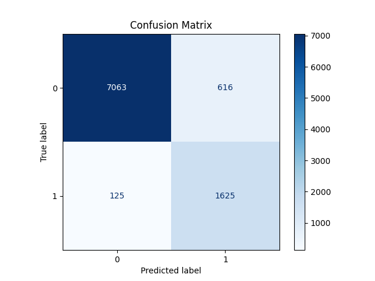

# Experiment 05

## Metrics
- F1 Score: 0.814
- Precision: 0.725
- Recall: 0.929
- Accuracy: 0.921

- Feature: dyn_acc_mean
- Feature: dyn_acc_std
- Feature: dyn_acc_max
- Feature: dyn_acc_median
- Feature: gyro_mag_mean
- Feature: gyro_mag_std
- Feature: gyro_mag_max
- Feature: mag_mag_std
- Feature: dyn_acc_mean_lag1
- Feature: dyn_acc_std_lag1
- Feature: dyn_acc_max_lag1
- Feature: dyn_acc_median_lag1
- Feature: gyro_mag_mean_lag1
- Feature: gyro_mag_std_lag1
- Feature: gyro_mag_max_lag1
- Feature: mag_mag_std_lag1
- Feature: dyn_acc_mean_lag2
- Feature: dyn_acc_std_lag2
- Feature: dyn_acc_max_lag2
- Feature: dyn_acc_median_lag2
- Feature: gyro_mag_mean_lag2
- Feature: gyro_mag_std_lag2
- Feature: gyro_mag_max_lag2
- Feature: mag_mag_std_lag2
- Feature: dyn_acc_mean_lag3
- Feature: dyn_acc_std_lag3
- Feature: dyn_acc_max_lag3
- Feature: dyn_acc_median_lag3
- Feature: gyro_mag_mean_lag3
- Feature: gyro_mag_std_lag3
- Feature: gyro_mag_max_lag3
- Feature: mag_mag_std_lag3
- Feature: dyn_acc_mean_lag4
- Feature: dyn_acc_std_lag4
- Feature: dyn_acc_max_lag4
- Feature: dyn_acc_median_lag4
- Feature: gyro_mag_mean_lag4
- Feature: gyro_mag_std_lag4
- Feature: gyro_mag_max_lag4
- Feature: mag_mag_std_lag4
- Feature: dyn_acc_mean_lag5
- Feature: dyn_acc_std_lag5
- Feature: dyn_acc_max_lag5
- Feature: dyn_acc_median_lag5
- Feature: gyro_mag_mean_lag5
- Feature: gyro_mag_std_lag5
- Feature: gyro_mag_max_lag5
- Feature: mag_mag_std_lag5
- Feature: dyn_acc_mean_lag6
- Feature: dyn_acc_std_lag6
- Feature: dyn_acc_max_lag6
- Feature: dyn_acc_median_lag6
- Feature: gyro_mag_mean_lag6
- Feature: gyro_mag_std_lag6
- Feature: gyro_mag_max_lag6
- Feature: mag_mag_std_lag6
- Feature: dyn_acc_mean_lag7
- Feature: dyn_acc_std_lag7
- Feature: dyn_acc_max_lag7
- Feature: dyn_acc_median_lag7
- Feature: gyro_mag_mean_lag7
- Feature: gyro_mag_std_lag7
- Feature: gyro_mag_max_lag7
- Feature: mag_mag_std_lag7
- Feature: dyn_acc_mean_lag8
- Feature: dyn_acc_std_lag8
- Feature: dyn_acc_max_lag8
- Feature: dyn_acc_median_lag8
- Feature: gyro_mag_mean_lag8
- Feature: gyro_mag_std_lag8
- Feature: gyro_mag_max_lag8
- Feature: mag_mag_std_lag8
- Feature: dyn_acc_mean_lag9
- Feature: dyn_acc_std_lag9
- Feature: dyn_acc_max_lag9
- Feature: dyn_acc_median_lag9
- Feature: gyro_mag_mean_lag9
- Feature: gyro_mag_std_lag9
- Feature: gyro_mag_max_lag9
- Feature: mag_mag_std_lag9
- Feature: dyn_acc_mean_lag10
- Feature: dyn_acc_std_lag10
- Feature: dyn_acc_max_lag10
- Feature: dyn_acc_median_lag10
- Feature: gyro_mag_mean_lag10
- Feature: gyro_mag_std_lag10
- Feature: gyro_mag_max_lag10
- Feature: mag_mag_std_lag10
- Feature: dyn_acc_mean_lag11
- Feature: dyn_acc_std_lag11
- Feature: dyn_acc_max_lag11
- Feature: dyn_acc_median_lag11
- Feature: gyro_mag_mean_lag11
- Feature: gyro_mag_std_lag11
- Feature: gyro_mag_max_lag11
- Feature: mag_mag_std_lag11
- Feature: dyn_acc_mean_lag12
- Feature: dyn_acc_std_lag12
- Feature: dyn_acc_max_lag12
- Feature: dyn_acc_median_lag12
- Feature: gyro_mag_mean_lag12
- Feature: gyro_mag_std_lag12
- Feature: gyro_mag_max_lag12
- Feature: mag_mag_std_lag12
- Feature: dyn_acc_mean_lag13
- Feature: dyn_acc_std_lag13
- Feature: dyn_acc_max_lag13
- Feature: dyn_acc_median_lag13
- Feature: gyro_mag_mean_lag13
- Feature: gyro_mag_std_lag13
- Feature: gyro_mag_max_lag13
- Feature: mag_mag_std_lag13
- Feature: dyn_acc_mean_lag14
- Feature: dyn_acc_std_lag14
- Feature: dyn_acc_max_lag14
- Feature: dyn_acc_median_lag14
- Feature: gyro_mag_mean_lag14
- Feature: gyro_mag_std_lag14
- Feature: gyro_mag_max_lag14
- Feature: mag_mag_std_lag14
- Feature: dyn_acc_mean_lag15
- Feature: dyn_acc_std_lag15
- Feature: dyn_acc_max_lag15
- Feature: dyn_acc_median_lag15
- Feature: gyro_mag_mean_lag15
- Feature: gyro_mag_std_lag15
- Feature: gyro_mag_max_lag15
- Feature: mag_mag_std_lag15
- Feature: dyn_acc_mean_diff1
- Feature: dyn_acc_std_diff1
- Feature: dyn_acc_max_diff1
- Feature: dyn_acc_median_diff1
- Feature: gyro_mag_mean_diff1
- Feature: gyro_mag_std_diff1
- Feature: gyro_mag_max_diff1
- Feature: mag_mag_std_diff1
## Model Path
- Model Path: saved_models/train_stop_detector_val_5.joblib

- Full Model Path: saved_models/train_stop_detector_6.joblib

## Confusion Matrix

