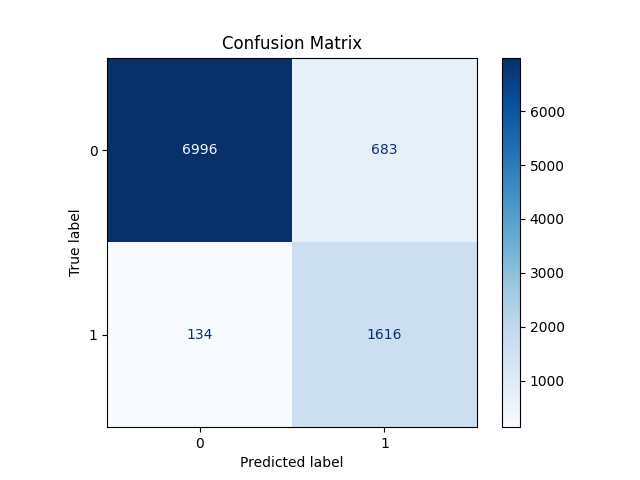

# Experiment 07

## Metrics
- F1 Score: 0.798
- Precision: 0.703
- Recall: 0.923
- Accuracy: 0.913

## Model Path
- Model Path: saved_models/train_stop_detector_val_7.joblib

- Full Model Path: saved_models/train_stop_detector_8.joblib

## Confusion Matrix

## Features
- 0 Feature: dyn_acc_mean
- 1 Feature: dyn_acc_std
- 2 Feature: dyn_acc_max
- 3 Feature: dyn_acc_median
- 4 Feature: gyro_mag_mean
- 5 Feature: gyro_mag_std
- 6 Feature: gyro_mag_max
- 7 Feature: mag_mag_std
- 8 Feature: dyn_acc_mean_lag1
- 9 Feature: dyn_acc_std_lag1
- 10 Feature: dyn_acc_max_lag1
- 11 Feature: dyn_acc_median_lag1
- 12 Feature: gyro_mag_mean_lag1
- 13 Feature: gyro_mag_std_lag1
- 14 Feature: gyro_mag_max_lag1
- 15 Feature: mag_mag_std_lag1
- 16 Feature: dyn_acc_mean_lag2
- 17 Feature: dyn_acc_std_lag2
- 18 Feature: dyn_acc_max_lag2
- 19 Feature: dyn_acc_median_lag2
- 20 Feature: gyro_mag_mean_lag2
- 21 Feature: gyro_mag_std_lag2
- 22 Feature: gyro_mag_max_lag2
- 23 Feature: mag_mag_std_lag2
- 24 Feature: dyn_acc_mean_lag3
- 25 Feature: dyn_acc_std_lag3
- 26 Feature: dyn_acc_max_lag3
- 27 Feature: dyn_acc_median_lag3
- 28 Feature: gyro_mag_mean_lag3
- 29 Feature: gyro_mag_std_lag3
- 30 Feature: gyro_mag_max_lag3
- 31 Feature: mag_mag_std_lag3
- 32 Feature: dyn_acc_mean_lag4
- 33 Feature: dyn_acc_std_lag4
- 34 Feature: dyn_acc_max_lag4
- 35 Feature: dyn_acc_median_lag4
- 36 Feature: gyro_mag_mean_lag4
- 37 Feature: gyro_mag_std_lag4
- 38 Feature: gyro_mag_max_lag4
- 39 Feature: mag_mag_std_lag4
- 40 Feature: dyn_acc_mean_lag5
- 41 Feature: dyn_acc_std_lag5
- 42 Feature: dyn_acc_max_lag5
- 43 Feature: dyn_acc_median_lag5
- 44 Feature: gyro_mag_mean_lag5
- 45 Feature: gyro_mag_std_lag5
- 46 Feature: gyro_mag_max_lag5
- 47 Feature: mag_mag_std_lag5
- 48 Feature: dyn_acc_mean_lag7
- 49 Feature: dyn_acc_std_lag7
- 50 Feature: dyn_acc_max_lag7
- 51 Feature: dyn_acc_median_lag7
- 52 Feature: gyro_mag_mean_lag7
- 53 Feature: gyro_mag_std_lag7
- 54 Feature: gyro_mag_max_lag7
- 55 Feature: mag_mag_std_lag7
- 56 Feature: dyn_acc_mean_lag9
- 57 Feature: dyn_acc_std_lag9
- 58 Feature: dyn_acc_max_lag9
- 59 Feature: dyn_acc_median_lag9
- 60 Feature: gyro_mag_mean_lag9
- 61 Feature: gyro_mag_std_lag9
- 62 Feature: gyro_mag_max_lag9
- 63 Feature: mag_mag_std_lag9
- 64 Feature: dyn_acc_mean_lag11
- 65 Feature: dyn_acc_std_lag11
- 66 Feature: dyn_acc_max_lag11
- 67 Feature: dyn_acc_median_lag11
- 68 Feature: gyro_mag_mean_lag11
- 69 Feature: gyro_mag_std_lag11
- 70 Feature: gyro_mag_max_lag11
- 71 Feature: mag_mag_std_lag11
- 72 Feature: dyn_acc_mean_lag13
- 73 Feature: dyn_acc_std_lag13
- 74 Feature: dyn_acc_max_lag13
- 75 Feature: dyn_acc_median_lag13
- 76 Feature: gyro_mag_mean_lag13
- 77 Feature: gyro_mag_std_lag13
- 78 Feature: gyro_mag_max_lag13
- 79 Feature: mag_mag_std_lag13
- 80 Feature: dyn_acc_mean_lag15
- 81 Feature: dyn_acc_std_lag15
- 82 Feature: dyn_acc_max_lag15
- 83 Feature: dyn_acc_median_lag15
- 84 Feature: gyro_mag_mean_lag15
- 85 Feature: gyro_mag_std_lag15
- 86 Feature: gyro_mag_max_lag15
- 87 Feature: mag_mag_std_lag15
- 88 Feature: dyn_acc_mean_diff1
- 89 Feature: dyn_acc_std_diff1
- 90 Feature: dyn_acc_max_diff1
- 91 Feature: dyn_acc_median_diff1
- 92 Feature: gyro_mag_mean_diff1
- 93 Feature: gyro_mag_std_diff1
- 94 Feature: gyro_mag_max_diff1
- 95 Feature: mag_mag_std_diff1
